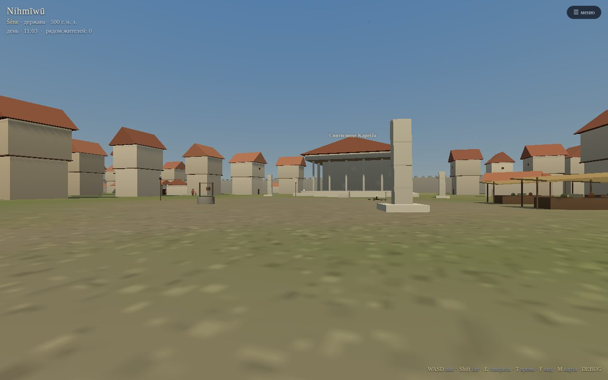
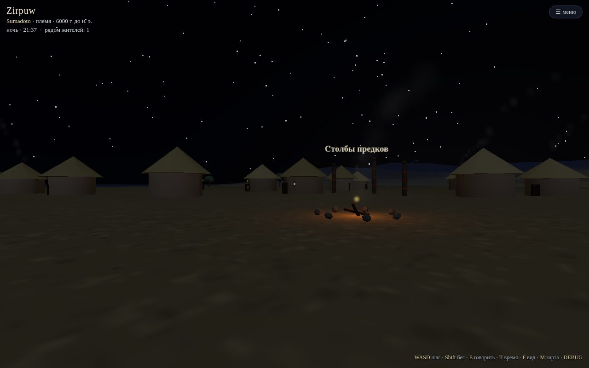
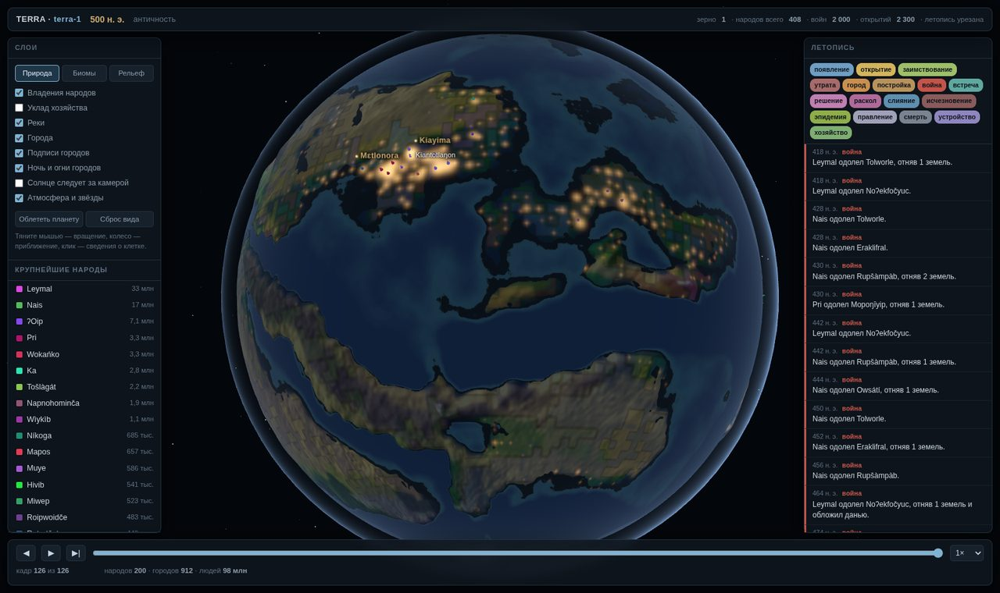
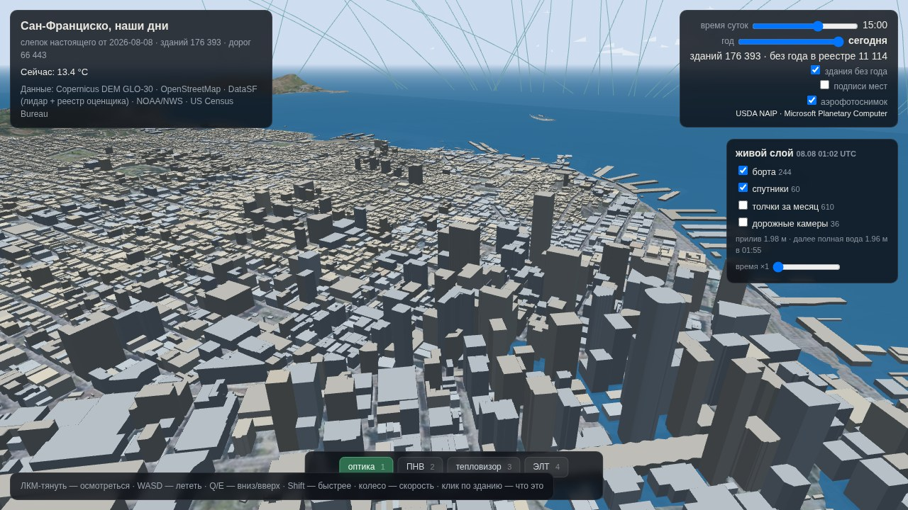
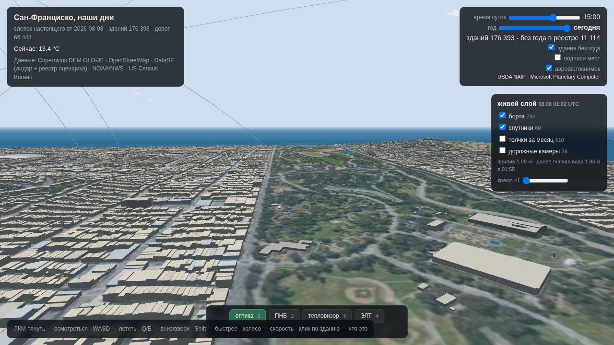
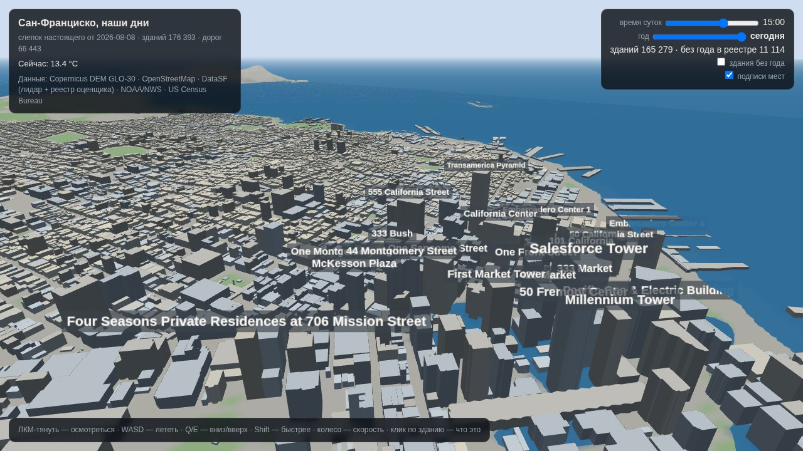
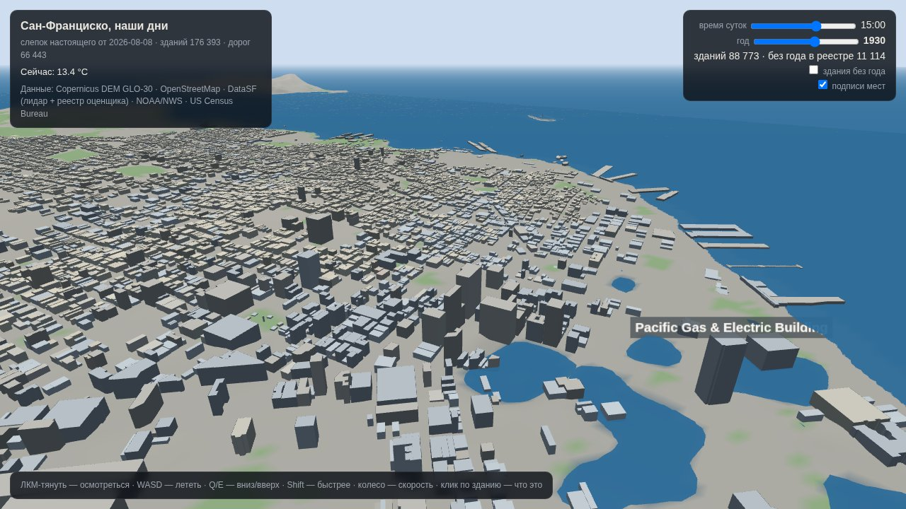
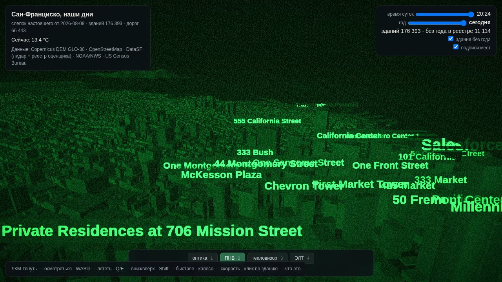
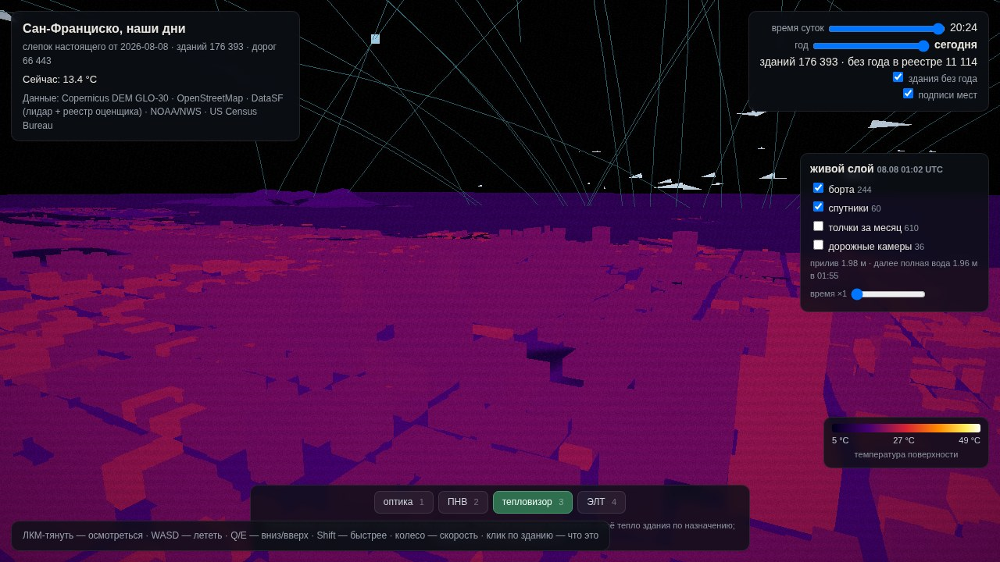
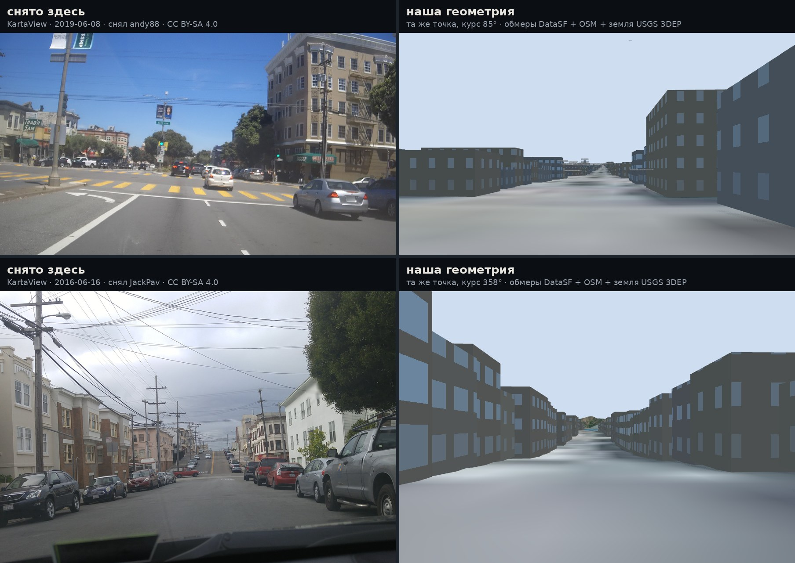

# TERRA

**A civilization simulator with sub-agent people — and the beginnings of a game built on top of it.**

TERRA starts an Earth-like planet at 12,000 BCE — the moment when humans, fire and
language already exist, and nothing else does. From there, history is not a script
but an outcome. Every simulated person has their own personality traits, needs,
kinship ties and a *subjective, often wrong* picture of the world. Each year they
choose what to do. Peoples, chiefdoms, cities, religions, wars and empires are not
entities anyone placed on the map — they are what millions of such choices add up to.

Worlds are fully deterministic: the same seed reproduces the same history down to
the last personal name. So history can be **replayed**: roll back to any year,
change one parameter, and watch destinies diverge.

**Live demo:** https://bekzod25-terra-world.static.hf.space/
*(3D first-person walk, rotating globe, atlas & chronicle, portrait gallery — note:
in-world text and UI are currently in Russian)*





---

## What emerges (not scripted)

- **No tech tree.** 123 pieces of knowledge are defined only by physical
  preconditions — affordances (cut, heat, store, count, record…), materials, biome,
  scale of a cohesive population, storable surplus. Discovery happens when a
  specific person with cognitive leisure stumbles onto a combination that works
  *here and now*. Bronze is skipped where there is no tin; farming may never appear
  without large-seeded wild grasses; writing is born only under accounting pressure
  in dense settlements.
- **Real dark ages.** A knowledge ceiling depends on the scale of the connected
  population. When a complex polity collapses (Tainter-style cost of complexity),
  cities empty, the ceiling drops, and skills literally crumble away — descendants
  can no longer do what their grandparents did.
- **Languages that branch.** Every culture has its own phonology; when a people
  splits, its language forks through 29 real sound laws. Personal names, ethnonyms,
  god names and city names are all generated from the living language.
- **People with biographies.** The world keeps a book of people: everyone who
  invented something, ruled, or decided at a crossroads is recorded with their
  name, lifespan, traits, beliefs and deeds.

Calibration against our own history (seed 1): population 2.2M at 11,000 BCE →
178M at 500 CE (Earth: ~3M → ~190M); planetary carrying capacity by subsistence
mode lands within real archaeological ranges.

## The game layer

`play.html` — a self-contained first-person walk (WASD + mouse) through three
scenes assembled *from simulation data*: an imperial capital in 500 CE (walls,
sanctuary, market), a Bronze Age river town with a ziggurat, a Neolithic village
at night by the fires. The inhabitants are the actual people from the world's
book of people; press **E** to talk — answers are generated from their recorded
traits, beliefs, gods and chronicle events. Paste an Anthropic API key into the
dialogue panel and NPCs converse freely in character (browser-side call,
`claude-haiku-4-5`).

## TERRA Twin — a digital twin of the present (new)

The mirror problem: instead of simulating a civilization forward from nothing,
assemble a faithful simulation of *the present* from real data and de-build it
into the past. First region: the San Francisco Bay Area.

```bash
python3 -m twin.ingest --budget 1500    # resumable open-data ingest (no API keys)
python3 -m twin.doctor                  # schema + physical sanity checks
python3 -m twin.view sf                 # twin_sf.html — fly over the real SF
```



The ground is a real photograph: USDA NAIP aerial imagery at 0.6 m/pixel,
public domain and keyless, stitched from Planetary Computer mosaic tiles and
laid under the buildings with Mercator-correct UVs. Travel back in time and it
switches itself off — that photo shows *today's* ground, and pretending
otherwise would be a lie the rest of the page doesn't tell.



`twin_sf.html` is a self-contained page: real 30 m terrain, all ~177k city
buildings (lidar heights from DataSF, names from OSM), streets, water, parks,
live NOAA weather, a day-time slider, click any building to identify it.

**And a year slider that de-builds the city.** 165k buildings carry their
construction year from the assessor roll, so dragging back to 1930 removes
every tower that had not been built — the filter runs in the vertex shader,
so the whole city re-dates at frame rate. Dated against reality: Transamerica
Pyramid 1972, Salesforce Tower 2018, Coit Tower 1933.

| 2026 | 1930 |
|---|---|
|  |  |

The page states its own uncertainty rather than hiding it: the assessor uses
1900 as a placeholder for "old" (14.5k parcels), everything downtown is dated
1906 or later because the fire took the city, and the 11k buildings with no
year at all can be toggled off to see exactly how much is unknown.

**A living present, and sensors to look at it with.** A timestamped snapshot
carries ~250 aircraft over the Bay (type, flight level, heading), 60 satellite
passes propagated through SGP4 and drawn where a viewer in San Francisco would
actually see them, a month of earthquakes, live Caltrans freeway cameras, and
the real tide — the bay surface sits at the water level measured at Fort Point.
Keys 1–4 switch the sensor: optical, night vision, thermal, CRT.

| night vision | thermal, after dark |
|---|---|
|  |  |

The thermal channel is not a palette on the rendered image. It computes a
surface temperature per vertex from the material's albedo and thermal inertia,
the sun's angle of incidence, the heat stored through the day and the
building's own internal load by use — with air temperature from the live NOAA
observation. Asphalt glows after dark, parks go cold, the bay stays flat. The
scale is printed in °C.

**Photographs of the same streets, as a check on the model.** The city here is
built from measurements — footprints, lidar heights, assessor years — so the
honest way to ask whether it resembles the real place is to stand where a
camera stood, face the way it faced, and compare. `twin/sources/streetlevel.py`
harvests real street-level frames from KartaView (dashcam imagery, CC BY-SA,
each with a position **and a camera heading**) plus geotagged building views
from Wikimedia Commons. No keys, and the frames stay at the source: only the
address, the author and the licence travel into the scene. Click a marker and
*stand here* puts the camera exactly at the shot and turns it to the shot's
heading; *follow along* keeps the nearest frame facing your way (±55°, within
250 m) beside you as you walk. A frame without a heading is useless for this,
which is why `doctor` insists on one.



That picture is the point of the feature. The street canyon, the building line
and the fall of the hill match a photograph taken from the same spot — the
skeleton is right. The trees, the cars, the poles and every surface do not
exist. Which is exactly the state of the model, now visible rather than
asserted, and exactly why the remaining work is an appearance layer over a
skeleton that already holds.

Two things the data taught us here: the raw dashcam GPS is off by tens of metres
(the records report 20 m accuracy themselves), so we prefer KartaView's
road-snapped position and fall back to raw only when the snap wanders more than
40 m; and some contributors mounted the camera upside down without recording it
in EXIF, so the panel carries a flip button that remembers its answer for the
whole sequence — one camera, one decision.

**Google's imagery, if you bring a key.** Three Google Maps Platform products
are wired in behind a key you enter in the browser — Street View Static (a
photograph from the exact spot and bearing you are standing at), Map Tiles 2D
satellite (a top-down mosaic stitched and laid on the terrain in place of
NAIP), and Photorealistic 3D Tiles (a small 3D Tiles traverser of our own,
placing Google's photogrammetry into the scene's local frame so the sensors and
time-of-day still apply to it). The key lives only in that browser's
localStorage and is sent only to Google; `doctor` fails the build if anything
resembling a key ever appears in the sources or the compiled scene. These three
layers are written but **unverified** — we have no key to run them against; the
keyless layers above are verified with Playwright.

**Bare earth under the city.** Copernicus GLO-30 is a *surface* model — it
measures whatever the radar bounced off, which downtown means rooftops, so the
"ground" is lifted by however tall the buildings are. `twin/sources/bareearth.py`
replaces it under each scene with **USGS 3DEP Bare Earth** (keyless), at a
3.9 × 4.6 m step instead of 30 m, with the built environment already subtracted.
The build prefers it automatically and then *stops* applying the 3×3 minimum
filter, which existed only to undo the surface model and would otherwise shave
the real ridges off the hills. `doctor` checks it where it matters: the scene's
highest point comes out at 287 m (Twin Peaks, really 282), and the financial
district sits at 4.8 m where the surface model claimed 7.2.

**Keys, and where they are not.** Everything above runs on keyless data.
[`docs/twin_keys.md`](docs/twin_keys.md) — generated from `twin/keys.py`, so the
two cannot drift — lists sixteen providers that would each add something
specific, of which **fourteen hand out a key against an email address**; only
Google Maps Platform and Anthropic require a payment card, and both are
optional. Ingest keys live in an environment variable or in a gitignored
`twin/.keys.json`; browser keys stay in the viewer's `localStorage`. `doctor`
greps the sources, the compiled scene and the built page for six shapes of
secret and fails the build on a hit.

Every record carries provenance (`source/license/tier/retrieved`) in the same K/T/R
discipline as the atlas; per-parcel construction years from the assessor roll
are the seed of the time machine (2026 → 1950 → 1906 → 1849 → 1776 →
pre-colonial). Strategy: [docs/twin_strategy.md](docs/twin_strategy.md).

## Unreal Engine 5 export

```bash
python3 -m terra.export_ue runs/terra-1
```

Produces, per scene: terrain meshes with baked color, PNG16 heightmaps and
material weightmaps, a building manifest (every footprint verified to sit on the
terrain within 30 cm), inhabitants with dialogue cards and patrol routes, 17
procedural proxy meshes (hut → ziggurat), plus `import_terra.py` for UE's built-in
Python that assembles the level in one run, and a step-by-step `README_UE.md`.
The road to photorealism from there is free within the Epic ecosystem
(Fab/Megascans materials, MetaHuman characters).

## Quick start

```bash
pip install numpy scipy pillow --break-system-packages
npm i three@0.185.1

python3 -m terra new --seed 1 --to 500 --name terra-1   # live 12,500 years (~1.5 h)
python3 -m terra doctor terra-1                         # physics self-check
python3 -m terra report terra-1                         # dashboard
python3 -m terra.play runs/terra-1                      # build the walkable game
python3 -m terra fork terra-1 --at -3000 --set climate_severity=1.8
python3 -m terra compare terra-1 terra-1-fork3000
python3 -m tests.test_terra --slow                      # 70+ checks incl. determinism
```

## Architecture

| layer | file | responsibility |
|---|---|---|
| L0 planet | `terra/world.py` | plate tectonics, 14,000-year climate history, rivers, ores, wild flora/fauna |
| L1 societies | `terra/society.py` | carrying capacity, soil balance, war, epidemics, institutions, collapse |
| L2 people | `terra/agents.py` | traits, needs, subjective beliefs, kinship, action choice, prestige imitation |
| cognition | `terra/knowledge.py` | 123 technologies as physical preconditions, no tree |
| languages | `terra/lang.py` | phonology, 29 sound laws, drift and branching |
| junctures | `terra/junctures.py` | pivotal decisions: heuristic / Anthropic API / file oracle |
| main loop | `terra/sim.py` | deterministic stepping, checkpoints, forking, book of people |
| game | `terra/play.py`, `terra/_play_js.py` | first-person scenes, NPC dialogue |
| UE bridge | `terra/export_ue.py`, `terra/ue/` | terrain/manifest export + UE editor-Python importer |
| viewers | `terra/globe.py`, `report.py`, `compact.py`, `gallery.py` | 3D globe, dashboard, light atlas, faces |
| atlas | `atlas/` | (early) real-history data pipeline: Wikidata, Pleiades, museum APIs |
| twin | `twin/` | digital twin of the present: SF Bay Area from open geodata, time machine to the past |

Pure Python 3.11 + numpy/scipy/Pillow; three.js is inlined into self-contained
HTML files. The simulation is the single source of truth — visualizations only read.

## Honest limitations

- The simulation models an Earth-*like* planet, not Earth; an "Earth mode" fed by
  real datasets (HYDE, Pleiades) is planned in `atlas/`.
- One polity is an ethno-political unit of thousands–millions; named individuals
  are a weighted sample, not the full population.
- The browser game is stylized low-poly; photorealism is the UE5 path.
- In-world text and interfaces are currently Russian.

*Built by Fable (Claude, Anthropic) in a Cowork session; the human sets direction
and accounts, the model writes the world.*
