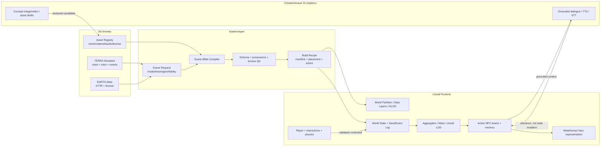

# TERRA — целевая архитектура

**Версия:** 0.1  
**Дата:** 2026-08-02  
**Назначение:** технический контракт между симуляцией, данными, генерацией контента и Unreal runtime

## 1. Архитектурная позиция

TERRA нельзя строить как один гигантский уровень Unreal или как чат с миллиардами LLM-персонажей. Система разделяется на:

1. авторитетную модель мира;
2. версионируемые реальные данные;
3. компилятор ограниченной сцены;
4. адаптивное runtime-представление;
5. генеративные сервисы, которые предлагают контент, но не устанавливают истину.

Основной закон: **масштаб меняет точность представления, но не идентичность и не баланс мира**.

## 2. Архитектурные инварианты

- `Mode` обязателен во всех сохранениях и запросах: `terra` или `earth`.
- Сущность имеет глобально уникальный стабильный `EntityId`.
- Историческое время не хранится только отображаемой строкой; нужен нормализованный `TimeKey`.
- Координаты всегда указывают систему отсчёта, единицы и преобразование в Unreal.
- Любой производный пакет содержит lineage: входы, версии компилятора, хэши и лицензии.
- LLM, PCG, генератор изображения или художник не меняет авторитетное состояние без валидированной команды/события.
- Состояние симуляции и представление Unreal разделены.
- TERRA и EARTH используют разные источники истины и никогда молча не сливаются.
- Разворачивание агрегата в NPC и обратное сворачивание детерминированы.
- Внешний сервис может исчезнуть; базовая прогулка и состояние мира продолжают работать.

## 3. Фактическая топология на момент takeover

| Узел | Роль | Текущее состояние | Ограничение |
|---|---|---|---|
| `KeyAIGit/terra` | Python-симуляция, экспортёры, Atlas pipeline, тесты | Содержимое описано handoff и доступно через GitHub | Код симуляции не находится внутри локальной папки UE |
| Hugging Face `terra-atlas` | Публикация Parquet и снапшотов | Около 1,2 ГБ, 12 источников по handoff/audit | Не транзакционная БД и не runtime state store |
| Локальный `Terra.uproject` | Unreal 5.8 presentation/runtime | Карта столицы, прокси и исходный export-пакет | Исходный baseline не имел собственного игрового runtime |
| `export_ue/` | Контракт Python → UE | Три сцены, JSON/OBJ/PNG/MTL и editor import script | Пакет — editor-time импорт, не полноценный runtime streaming format |
| Публичная HF-витрина | Браузерное представление | Показывает старый `terra-1` | Не является каноном актуального `terra-life` |

Локальная UE-папка на начало takeover не была самостоятельным Git checkout. До масштабных правок бинарных ассетов требуется отдельная стратегия версионирования.

## 4. Логическая схема



## 5. Матрица авторитетности

| Данные | Авторитетный слой | Unreal хранит | Генеративный AI может |
|---|---|---|---|
| Население/ресурсы/знания TERRA | checkpoint + event log симуляции | кэш видимого среза | предложить объяснение/реплику |
| Факт EARTH | Atlas record + source | локальный read-only projection | сформулировать реконструкцию с `R` |
| Позиция активного предмета | runtime world state/save | актуальное состояние | предложить действие, не применять его |
| Внешность NPC | scene bible + asset registry | mesh/material/LOD | создать концепт-кандидат |
| Память NPC | структурированная memory store | горячий рабочий набор | суммировать с проверяемыми ссылками на записи |
| Реплика NPC | dialogue service result + контекст | временный текст/аудио | сгенерировать в рамках знаний персонажа |
| Лицензия | asset/data registry | ID/атрибуция | не может изменить или «додумать» |

## 6. Общие контракты данных

### 6.1. Идентичность мира

```text
WorldRef = {
  mode,                 // terra | earth
  world_id,             // immutable ID
  branch_id,            // timeline branch
  simulation_version,   // rules/code version or earth-canon version
  catalog_version,
  seed?,                // only where applicable
  parent_checkpoint?
}
```

`world_id` не равен имени папки и не выводится только из seed: версия правил и каталог тоже влияют на результат.

### 6.2. Время

```text
TimeKey = {
  calendar,             // astronomical_year, gregorian, simulation_tick...
  instant_or_range,
  precision,            // second, day, year, century, uncertain
  uncertainty_before,
  uncertainty_after
}
```

Для древней истории дата часто является диапазоном. UI может показывать «около 1500 до н. э.», но внутренний контракт не должен притворяться точным годом.

### 6.3. Пространство

```text
SpatialRef = {
  crs,                  // EPSG / planetary frame / local scene
  geometry,
  vertical_datum,
  units,
  unreal_transform
}
```

Текущий экспорт использует сантиметры, `X/Y` как плоскость сцены и `Z` вверх. Это фиксируется в manifest и не предполагается по имени файла.

### 6.4. Утверждение EARTH

```text
EvidenceClaim = {
  claim_id,
  subject_id,
  predicate,
  value,
  time,
  space,
  evidence_tier,        // K | T | R
  source_refs[],
  confidence,
  license_id,
  transform_history[],
  reviewer_status
}
```

`confidence` не заменяет `evidence_tier`: хорошо выполненная реконструкция всё равно остаётся `R`.

### 6.5. Сущность человека

Минимальный общий контракт:

```text
PersonState = {
  entity_id,
  world_ref,
  biological_state,
  appearance_profile,
  household_and_relations,
  traits_and_beliefs,
  skills_and_knowledge,
  needs,
  schedule,
  memories,
  current_goal,
  current_spatial_ref,
  representation_lod,
  last_authoritative_tick
}
```

В TERRA поля выводятся из симуляции. В EARTH часть полей может быть неизвестной; пустота предпочтительнее выдуманного факта. Для runtime допускается `R`-проекция, но она хранится отдельно от канона.

## 7. Разделение режимов

### 7.1. TERRA adapter

Входы:

- checkpoint;
- event log;
- seed и версии;
- запрос пространственно-временного среза.

Выход:

- authoritative entities;
- агрегаты населения/экономики;
- биографии и причинные события;
- material affordances и культурный контекст.

### 7.2. EARTH adapter

Входы:

- Atlas records;
- политика разрешения конфликтов;
- временной и пространственный запрос;
- разрешённые наборы данных по лицензии.

Выход:

- K/T/R claims;
- coverage map и известные пробелы;
- допустимые реконструкции;
- список обязательных атрибуций.

### 7.3. Counterfactual adapter

При первом действии, несовместимом с каноном:

1. фиксируется Earth checkpoint и исходные K/T/R;
2. создаётся новый `world_id` режима TERRA/counterfactual;
3. известные условия становятся начальными ограничениями;
4. все последующие события принадлежат новой ветви;
5. UI постоянно показывает, что это альтернативная история.

## 8. Многоуровневая симуляция и LOD

### 8.1. Иерархия состояния

| Уровень | Представление | Типичный шаг времени | Runtime |
|---|---|---|---|
| S0 Космос/планета | орбиты, климатические поля, глобальные балансы | годы–дни | аналитика/кэш, не акторы |
| S1 Регион | население, ресурсы, торговля, эпидемии, политии | месяцы–дни | агрегированные записи |
| S2 Поселение/когорта | домохозяйства, профессии, здания, потоки | дни–часы | компактный ECS/таблицы |
| S3 Толпа | видимые жители с простым расписанием | секунды | Mass Entity/легковесные представления |
| S4 Активный NPC | цели, навигация, реакция, рабочая память | кадр–секунды | Character/Pawn + StateTree/utility AI |
| S5 Hero NPC | полная внешность, лицо, разговор, подробная память | кадр/по запросу | ограниченное число MetaHuman-уровня |

Названия движковых технологий не являются интеллектом: **Mass Entity хранит и обрабатывает данные/LOD толпы, но не создаёт мотивацию или личность**. Мозг NPC задаётся TERRA-контрактами, планировщиком и памятью.

### 8.2. Четыре независимых LOD

- **Spatial LOD:** дальняя планета → регион → город → район → комната.
- **Temporal LOD:** годы для удалённого агрегата → секунды для локальной сцены.
- **Behavioral LOD:** статистическая когорта → расписание → реактивный агент → подробный герой.
- **Visual LOD:** точка/instance → crowd mesh → skeletal NPC → MetaHuman hero.

Нельзя связывать их одним числом. Близкий неподвижный исторический объект может иметь высокий visual LOD и низкий behavioral LOD; удалённый правитель может иметь сложную симуляцию и вообще не рендериться.

### 8.3. Правила перехода expand/collapse

При разворачивании агрегата:

1. берётся стабильный aggregate ID и checkpoint;
2. детерминированно создаются домохозяйства и личности в рамках известных сумм;
3. распределяются ресурсы, навыки и отношения без изменения агрегатных балансов;
4. создаётся `ExpansionLedger` с контрольными суммами;
5. активные сущности получают ownership текущего уровня.

При сворачивании:

1. завершаются или сериализуются незаконченные действия;
2. изменения суммируются в агрегат;
3. проверяются население, ресурсы, деньги, знания и уникальные сущности;
4. подробная память сжимается, но важные события и отношения сохраняются;
5. один и тот же человек не остаётся одновременно в двух уровнях.

Обязательны hysteresis и cooldown, чтобы сущности не разворачивались каждый кадр на границе зоны.

## 9. Scene Bible Compiler

### 9.1. Назначение

Scene bible — независимое от Unreal семантическое описание того, что должно существовать в конкретных `mode × world × time × region × fidelity`.

Текущий `export_ue` является ранним предшественником: он уже содержит `meta.json`, здания, дороги, людей, OBJ и маски. Целевая bible расширяет этот контракт и делает происхождение обязательным.

### 9.2. Запрос

```json
{
  "mode": "terra",
  "world_id": "terra-life",
  "time": {"calendar": "astronomical_year", "year": 500},
  "region": {"kind": "local_scene", "id": "capital-core"},
  "fidelity_profile": "vertical-slice-v1",
  "target": "unreal-5.8-macos",
  "language": "ru"
}
```

### 9.3. Проходы компилятора

1. **Resolve:** найти authoritative snapshot и входные наборы.
2. **Normalize:** привести время, координаты, единицы и ID.
3. **Evidence fusion:** для EARTH собрать K/T/R, конфликты и coverage.
4. **Semantic expansion:** выбрать здания, жителей, занятия, флору, погоду и социальный контекст.
5. **Gap policy:** оставить пробел либо создать явно помеченную R-реконструкцию.
6. **Layout:** построить дороги, участки, помещения, точки интереса и nav hints.
7. **Asset resolution:** сопоставить семантический тип с лицензированным ассетом и LOD.
8. **Runtime projection:** определить, какие сущности S2/S3/S4/S5 попадут в загрузку.
9. **Build recipe:** сформировать Unreal-friendly placements, DataAssets/DataTables и external payloads.
10. **Validate:** схемы, ссылки, лицензии, геометрию, бюджеты и контрольные суммы.
11. **Publish:** immutable bundle + lineage manifest.

### 9.4. Состав bundle

```text
scene_bundle/
  manifest.json
  provenance.parquet
  entities.parquet
  people.parquet
  buildings.parquet
  routes.parquet
  interactions.json
  environment.json
  asset_bindings.json
  unreal_build_recipe.json
  geometry/
  textures/
  qa/
    schema_report.json
    license_report.json
    budget_report.json
    screenshots.json
```

OBJ/PNG допустимы как обменный формат на раннем этапе. Для повторных runtime-загрузок нужны более эффективные cooked assets и данные, а не editor import при каждом запуске.

## 10. Unreal runtime

### 10.1. Модульная граница

Runtime должен жить в C++-плагине `TerraRuntime`, чтобы не зависеть от ручного состояния карты. Blueprint используется для настройки и контента, но ключевые контракты сериализации, взаимодействия и ID определяются в C++.

Целевые модули:

```text
TerraRuntime/
  Contracts/       // world, scene, entity, NPC, provenance structs
  Data/            // DataAssets, tables, JSON/Parquet projections
  World/           // world subsystem, streaming, time, weather
  Player/          // first-person character/controller
  Interaction/     // focus, interface, authoritative command
  NPC/             // schedule, state, memory, dialogue adapter
  Save/            // snapshot + event journal
  UI/              // mode/provenance/interactions/debug
  Tests/           // automation and functional tests
```

Первый takeover-инкремент проектирует:

- сериализуемые структуры NPC и сцены и DataAsset-обёртки;
- `TerraInteractable` как единый BlueprintNativeEvent-контракт;
- компонент локального focus trace и server-authoritative interaction RPC;
- first-person Character с клавиатурой, мышью, gamepad, прыжком, приседанием и ускорением;
- базовый `TerraGameModeBase`.

Пока плагин не собран и не назначен в `.uproject`/карте, эти классы являются реализацией в работе, а не подтверждённой функцией продукта.

### 10.2. Запуск и владение состоянием

- `GameInstanceSubsystem` хранит выбранный WorldRef, сервисы данных и сессию.
- `WorldSubsystem` управляет локальным временем, активными зонами и projection cache.
- `GameMode` создаёт правила одиночной/серверной сессии.
- `PlayerController` преобразует input в команды.
- `Character` отвечает за движение и телесное представление игрока.
- `SaveSubsystem` пишет snapshot и append-only события.
- Актор Unreal не является единственным хранилищем сущности; он держит `EntityId` и runtime projection.

### 10.3. Мир и стриминг

- World Partition — пространственная загрузка контента.
- Data Layers — эпохи, сезонные и режимные варианты.
- HLOD — дешёвое дальнее представление.
- PCG — сборка растительности, повторяемых деталей и layout по recipe.
- Large World Coordinates — движковая основа точности больших координат; планетарный проект всё равно требует явных CRS, локальных frames и проверенных преобразований.
- One File Per Actor или эквивалент снижает конфликты командной работы.

Эти технологии загружают и размещают данные, но **не определяют историческую истину**.

### 10.4. Рендер

- Nanite — плотная статическая геометрия там, где поддерживается целевой pipeline.
- Lumen — динамическое освещение и отражения с измеренным scalability fallback.
- Virtual Shadow Maps — детальные динамические тени в пределах бюджета.
- Substrate/материалы — физически правдоподобные поверхности.
- Sky/atmosphere/cloud/water — отдельные системные слои, привязанные к времени и климату.

Флаги в `DefaultEngine.ini` не доказывают, что функция работает быстро или одинаково на macOS. Каждая комбинация проходит device profile и профильный тест.

### 10.5. Физика

Chaos даёт игровую rigid-body, destruction, cloth и связанные инструменты, но не является универсальным симулятором реальности. Авторитетный макромир считает свои балансы отдельно; Chaos отвечает только за наблюдаемую локальную физику и превращает результат в валидированные события.

Пример:

```text
игрок разбил сосуд в Chaos
  -> interaction validator подтверждает сущность и импульс
  -> WorldEvent(VesselBroken, entity_id, actor_id, time)
  -> инвентарь/экономика обновляются авторитетно
  -> визуальные осколки могут быть временными
```

## 11. NPC runtime

### 11.1. Слои мозга

1. **Body:** движение, анимация, восприятие, интеракции.
2. **Reactive:** немедленные реакции на опасность, препятствие, обращение.
3. **Routine:** расписание, работа, сон, еда, социальные точки.
4. **Utility/StateTree:** выбор цели из потребностей, роли и убеждений.
5. **Planner:** редкие многошаговые решения для значимых NPC.
6. **Dialogue:** формулировка речи из разрешённого контекста.

LLM не управляет каждым шагом и не заменяет NavMesh, perception или планировщик.

### 11.2. Представление толпы

Официально подтверждённый путь MetaHuman 5.8 для толпы использует интеграцию с Mass и LOD от Actor-представления к инстансированным мешам. Он подходит для визуального уровня, но TERRA всё равно должна предоставить стабильные ID, социальное состояние и правила поведения.

Рекомендуемое распределение в вертикальном срезе:

- 3–5 hero NPC: MetaHuman-уровень, лицо/голос/подробная память;
- 10–20 active NPC: skeletal Character с расписанием;
- остальные видимые: crowd/Mass representation;
- за пределами района: агрегаты, без акторов.

Точные количества меняются только после Unreal Insights и memory profiling.

### 11.3. Память

```text
WorkingMemory       секунды–минуты, локально у active NPC
EpisodicMemory      важные события с entity/time/place IDs
SemanticMemory      убеждения и знания, доступные персонажу
RelationshipState   доверие, долг, родство, конфликт
SummaryMemory       сжатая история для выгруженного NPC
```

Каждая память имеет источник: наблюдение, услышанное, личное действие или системная реконструкция. NPC может ошибаться; ошибка хранится как его убеждение, а не изменяет канон.

### 11.4. Grounded dialogue

Запрос содержит:

- ID и role/persona;
- доступные персонажу факты и убеждения;
- последние эпизоды и отношения с собеседником;
- место, время, видимые события;
- лингвистический и культурный стиль;
- запрещённые действия и бюджет.

Ответ содержит:

- реплику;
- структурированное намерение/эмоцию;
- ссылки на использованные memory/claim IDs;
- необязательное предложение действия.

Предложение действия проходит игровой validator. Текст сам не меняет деньги, отношения, задания или исторический факт.

При недоступности AI-сервиса используется детерминированная шаблонная речь из тех же данных.

## 12. MetaHuman и производственный конвейер персонажа

### 12.1. Подтверждённые возможности UE/MetaHuman 5.8

- Mesh-to-MetaHuman и Python API могут ускорять создание согласованной основы персонажа.
- MetaHuman Animator поддерживает facial animation из камеры, аудио и моно-видео.
- Markerless body capture остаётся экспериментальным и Windows-only; проект на Mac не должен зависеть от него как от обязательного пути.
- MetaHuman Crowds интегрируется с Mass и имеет representation LOD.

Ни одна из этих возможностей отдельно или вместе не подтверждает буквальную «неотличимость от реальности» и не задаёт достоверную дату её достижения.

### 12.2. Целевой pipeline

```text
Scene Bible person
  -> исторические/демографические ограничения
  -> text-to-image concept candidates
  -> approved face/body design
  -> mesh/scan or MetaHuman parameters
  -> MetaHuman/custom rig
  -> skin/hair/clothing/material authoring
  -> body mocap/library + retarget
  -> facial solve from camera/audio/video
  -> Control Rig / Motion Matching cleanup
  -> gameplay LOD + collision + physics
  -> license/performance/visual QA
  -> Asset Registry binding
```

Текст, изображение или видео сами по себе не дают production-ready rigged character. Генеративный результат — кандидат в этом конвейере.

### 12.3. Вариативность без бесконечного ручного труда

- базовые archetypes по региону/эпохе создаются и проверяются вручную;
- лица, возраст, телосложение, волосы, одежда и повреждения параметризуются;
- герои получают уникальные ассеты;
- массовые жители используют совместимые модули и LOD;
- повторяемость измеряется автоматическим diversity report;
- запрещено выводить внешность непосредственно из сомнительных этнических стереотипов.

## 13. Хранилища

| Категория | Сейчас/первый этап | Масштабный этап |
|---|---|---|
| Код и схемы | GitHub | GitHub + защищённый CI |
| Unreal binaries | Локальная копия; немедленно добавить Git LFS или Perforce | Perforce либо строго управляемый Git LFS |
| Atlas | HF Datasets/Parquet | HF snapshot + object store/CDN |
| Аналитические запросы | DuckDB поверх Parquet | DuckDB/Spark по необходимости |
| Одиночное сохранение | SQLite или бинарный snapshot + event log | Версионируемый save format |
| Серверный мир | не нужен V0.1 | PostgreSQL/PostGIS + event log |
| Диалоговая память | SQLite/локальный индекс | серверная БД + опциональный vector index |
| Собранные сцены | локальный immutable bundle | object store/CDN |
| Секреты | macOS Keychain/env/CI secret | управляемый secret manager |

Hugging Face остаётся хорошим публичным/версионируемым домом для наборов данных. Он не заменяет PostGIS, сохранение игры, блокировки бинарных карт или secret manager.

## 14. События и сохранения

### 14.1. Команда и событие

- **Command:** намерение, которое может быть отклонено (`OpenDoor`, `TakeItem`, `TellNPC`).
- **Event:** уже принятое изменение мира (`DoorOpened`, `ItemTransferred`, `NPCHeardStatement`).

Каждое событие содержит:

```text
event_id, world_ref, tick/time, actor_id, target_ids,
event_type, payload_schema_version, provenance, causation_id
```

### 14.2. Save format

- immutable base scene bundle;
- текущий simulation checkpoint;
- локальный runtime snapshot;
- append-only event tail;
- версии схем и миграции;
- hash целостности.

Сохранение не копирует целиком гигантский Atlas или все cooked assets.

## 15. Asset Registry

Каждый ассет имеет:

```text
asset_id
semantic_tags             // era, region, building_type, material...
source_uri
license_id
allowed_distribution
author/creator
generation_metadata?
review_status
unreal_soft_object_path
platform_support
visual_lods[]
collision_profile
performance_cost
provenance_claim_ids[]
```

Scene compiler выбирает ассет только среди разрешённых и проверенных. Отсутствующий ассет возвращает диагностируемый proxy, а не случайный красивый объект из другой эпохи.

## 16. Разработка с субагентами

### 16.1. Роли

| Поток | Ответственность | Артефакт приёмки |
|---|---|---|
| Lead/integrator | контракты, приоритеты, merge, решение конфликтов | зелёная интеграционная сборка |
| Simulation | детерминизм, LOD, экономика, демография | tests + doctor + A/B calibration |
| Data/Atlas | ingest, provenance, licenses, scene compiler | schema/license/coverage reports |
| Unreal runtime | C++, input, interaction, NPC, save, profiling | compiled plugin + automation tests |
| Content | персонажи, окружение, анимация, звук | registry entries + visual/perf QA |
| QA | сценарии, screenshots, logs, regressions | release evidence bundle |

### 16.2. Ограничения параллельной работы

- общие header/schema-файлы меняет один назначенный владелец;
- бинарная `.umap`/`.uasset` блокируется на время редактирования;
- каждый субагент получает отдельную папку или worktree;
- generated files не редактируются вручную;
- интеграция идёт маленькими проверяемыми инкрементами;
- длительные прогоны имеют heartbeat/checkpoint, но агенты не считаются постоянно работающим фоновым штатом вне активной задачи.

## 17. Тестовая пирамида

### 17.1. Симуляция

- unit tests формул и контрактов;
- deterministic replay;
- достижимость каталога знаний;
- conservation/invariant tests;
- A/B мини-мир при калибровочных правках;
- полный doctor checkpoint.

### 17.2. Данные

- schema validation;
- referential integrity;
- CRS/time normalization;
- provenance completeness;
- license allowlist;
- coverage и конфликтующие claims;
- scene bundle hash/rebuild equality.

### 17.3. Unreal

- plugin compile на целевых конфигурациях;
- Automation tests сериализации и взаимодействий;
- Functional Test карты;
- commandlet проверки ссылок и missing assets;
- unattended map load/cook;
- 15-минутный gameplay soak;
- Unreal Insights: game/render/GPU/memory;
- скриншоты фиксированных камер и visual diff с порогом.

### 17.4. AI

- groundedness: каждый использованный claim разрешён NPC;
- эпоха/язык/persona consistency;
- запрет прямой state mutation;
- fallback без сети;
- latency/cost budget;
- red-team prompt injection через диалог игрока.

## 18. Наблюдаемость

Минимальные метрики runtime:

- FPS, game/render/GPU frame time;
- streaming hitch и время загрузки cell;
- число S2/S3/S4/S5 сущностей;
- nav failures и stuck NPC;
- dialogue latency, fallback rate и token/cost budget;
- save duration и migration errors;
- missing asset/provenance/license count;
- expand/collapse conservation failures.

Debug HUD должен показывать `mode/world/time/region`, активные LOD, seed/version и EntityId под прицелом.

## 19. Безопасность и приватность

- все ранее появлявшиеся в handoff токены считаются отозванными/подлежащими ротации и не копируются в новые документы;
- клиентская Unreal-сборка не вызывает модель с постоянным секретом;
- внешние запросы имеют allowlist, rate limit и минимальный контекст;
- raw voice/video пользователя не сохраняется без отдельного согласия;
- сгенерированные лица и голоса проходят consent/license review;
- плагины и ассеты проверяются до включения в build;
- публикация данных и сборок — отдельное авторизованное действие.

## 20. Отказоустойчивость

| Отказ | Поведение |
|---|---|
| Нет сети/LLM | шаблонный grounded-диалог, мир продолжает работать |
| Missing hero asset | проверенный crowd/proxy fallback с тем же EntityId |
| Scene bundle невалиден | загрузка блокируется до изменения мира; понятный validation report |
| Повреждён save tail | восстановление последнего валидного snapshot + журнал ошибки |
| NPC не нашёл путь | bounded retry, fallback Smart Object, telemetry; без бесконечного тика |
| Превышен performance budget | понижение visual/crowd LOD, но не удаление авторитетной сущности |
| Конфликт Earth-источников | обе версии в provenance; UI показывает неопределённость |
| Нет права на ассет | proxy, ассет не входит в cook/distribution |

## 21. Архитектурные gates

### Gate A — Runtime foundation

- плагин компилируется;
- собственные GameMode/Character запускаются;
- единый interaction contract работает;
- NPC/scene structs проходят round-trip serialization.

### Gate B — Data-driven scene

- текущий capital bundle валидируется;
- акторы получают стабильные EntityId;
- карта пересобирается из recipe без ручной расстановки;
- manifest содержит lineage.

### Gate C — Living slice

- active/crowd/hero LOD переходы;
- расписания, память, grounded dialogue;
- save/load и fallback без сети.

### Gate D — Scale

- World Partition/Data Layers/HLOD;
- scene bible compiler;
- expand/collapse conservation;
- подтверждённый performance budget.

### Gate E — Earth canon

- K/T/R schema и UI;
- license gate;
- конфликтующие источники;
- counterfactual fork без изменения канона.

## 22. Открытые архитектурные решения

До Gate B нужно зафиксировать ADR:

1. Git LFS или Perforce для UE binaries.
2. Blueprint-only интеграция или C++ target проекта для подключения `TerraRuntime`.
3. Формат первого runtime bundle: JSON/DataAsset или SQLite projection.
4. Схема `EntityId` и миграция текущих людей без ID.
5. Выбор первого hero-zone и список доступных интерьеров.
6. Локальный или серверный dialogue service в прототипе.
7. Целевой Mac device profile и точный FPS/качество preset.
8. Какие наборы Atlas разрешены для распространяемого Earth pilot.
9. Нужен ли Windows-узел для необязательного experimental body-capture pipeline; core-путь не должен от него зависеть.

## 23. Официальная техническая опора

Эти ссылки подтверждают границы используемых движковых возможностей; они не являются доказательством готовности TERRA или обещанием полной симуляции реальности.

- [MetaHuman Creator в Unreal Engine](https://dev.epicgames.com/documentation/metahuman/metahuman-creator-in-unreal-engine)
- [MetaHuman 5.8 release notes](https://dev.epicgames.com/documentation/metahuman/metahuman-5-8-release-notes-in-unreal-engine)
- [MetaHuman Animator](https://dev.epicgames.com/documentation/metahuman/metahuman-animator-in-unreal-engine)
- [Mass Entity overview](https://dev.epicgames.com/documentation/unreal-engine/overview-of-mass-entity-in-unreal-engine)
- [Mass Gameplay overview](https://dev.epicgames.com/documentation/en-us/unreal-engine/overview-of-mass-gameplay-in-unreal-engine)
- [World Partition](https://dev.epicgames.com/documentation/en-us/unreal-engine/world-partition-in-unreal-engine)
- [Large World Coordinates](https://dev.epicgames.com/documentation/en-us/unreal-engine/large-world-coordinates-in-unreal-engine-5)
- [Procedural Content Generation Framework](https://dev.epicgames.com/documentation/en-us/unreal-engine/procedural-content-generation-framework-in-unreal-engine)
- [Physics / Chaos](https://dev.epicgames.com/documentation/unreal-engine/physics-in-unreal-engine)
- [Nanite Virtualized Geometry](https://dev.epicgames.com/documentation/en-us/unreal-engine/nanite-virtualized-geometry-in-unreal-engine)
- [Lumen Global Illumination and Reflections](https://dev.epicgames.com/documentation/en-us/unreal-engine/lumen-global-illumination-and-reflections-in-unreal-engine)
- [Unreal MCP in Unreal Editor](https://dev.epicgames.com/documentation/unreal-engine/unreal-mcp-in-unreal-editor) — возможный канал editor automation; не runtime-интеллект и не источник данных мира.

## 24. Антипаттерны

- хранить токен модели в HTML/Blueprint;
- делать «разум» NPC одним большим prompt без структурированного состояния;
- размещать Earth-реконструкцию без `R`;
- строить миллионы полных Actors вместо LOD/ECS;
- считать Mass Entity готовым поведением;
- считать Chaos полной физикой мира;
- считать PCG источником исторической истины;
- использовать MetaHuman для каждого дальнего прохожего;
- вручную чинить generated map без обратной записи в recipe;
- принимать красивый кадр без профилирования и 15-минутного теста;
- обещать дату «полной неотличимости от реальности».
