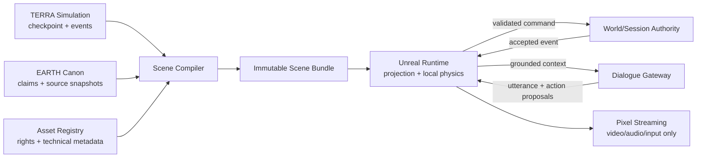
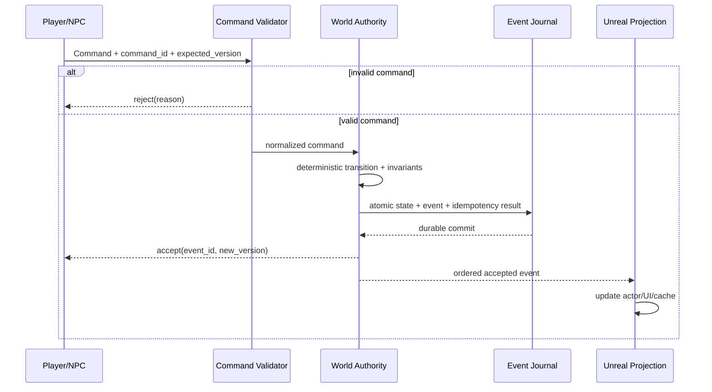

# TERRA — архитектурный контракт

**Версия:** 0.2  
**Дата:** 2026-08-02  
**Статус:** исполнимый целевой контракт; не заявление о готовности продукта  
**Связанные документы:** [спецификация продукта](TERRA_PRODUCT_SPEC_RU.md), [roadmap](TERRA_ROADMAP.md), [Pixel Streaming 2](TERRA_PIXEL_STREAMING_2.md)

## 0. Как читать этот документ

Этот документ фиксирует, **кто владеет каждым видом состояния, через какие
контракты оно проходит и каким gate подтверждается**. Он не превращает
целевую схему в уже работающую систему.

Метки состояния обязательны:

| Метка | Значение |
|---|---|
| **CURRENT / VERIFIED** | Проверено в локальных файлах, тестом или публичным API на дату документа |
| **CURRENT / REPORTED** | Передано в handoff, но не связано с текущей сборкой автоматическим lineage |
| **NEXT** | Следующий обязательный контракт до живого вертикального среза |
| **FUTURE** | Нужен только после доказанного среза или при явном триггере масштаба |
| **REJECTED** | Намеренно запрещённый путь |

Слова **MUST / ДОЛЖЕН**, **MUST NOT / НЕ ДОЛЖЕН** и **SHOULD / СЛЕДУЕТ**
нормативны. Любое исключение оформляется ADR с владельцем и сроком пересмотра.

## 1. Архитектурный результат

TERRA состоит не из «одного огромного Unreal-уровня», а из замкнутой цепочки:

1. авторитетный мир или авторитетный набор Earth-утверждений;
2. нормализованный запрос ограниченного среза;
3. детерминированный Scene Compiler;
4. неизменяемый, проверенный scene bundle;
5. Unreal-проекция, которая визуализирует bundle и отправляет назад только
   формализованные команды;
6. журнал принятых событий и сохранение, ссылающееся на исходный bundle.

Главный закон:

> Масштаб и качество представления могут меняться, но идентичность, причинность,
> происхождение данных и сохраняемые балансы мира меняться молча не могут.

Ближайший продуктовый предел — один живой район на 15–30 минут. Полная
«неотличимая реальность» не имеет доказанного пути, даты или критерия полного
тестирования и не является релизным обещанием.

## 2. Зафиксированный baseline

### 2.1. Что действительно существует

| Область | Состояние | Метка |
|---|---|---|
| Upstream симуляции | Публичный `KeyAIGit/terra`, `main` на `6f33b2ec…`; Python-модули планеты, обществ, людей, знаний, языков, прогонов и Atlas | CURRENT / VERIFIED |
| Интеграционная ветка | Draft PR `#1`, ветка `codex/terra-reality-foundation`, проверенный remote head `0b408c7f…`; text source имеет GitHub recovery path, но BuildIdentity всё ещё требует clean source snapshot binding | CURRENT / VERIFIED |
| Локальный UE-проект | UE 5.8, `TerraRuntime`, Python Editor, MetaHuman Generator, локальный MCP и Pixel Streaming 2 включены | CURRENT / VERIFIED |
| Сохранённый Content | Только legacy `/Game/Terra/Maps/L_capital` и связанные capital assets; 71 saved files имеют точную same-disk snapshot copy, 71/71 SHA-256 совпали; digest-версия `/Game/TerraLife/...` ещё не импортирована | CURRENT / VERIFIED |
| Актуальный export | `terra-life`: три сцены, 150 файлов, 0 ошибок/предупреждений, 614 provisional UUIDv5 | CURRENT / VERIFIED |
| Старый пакет Downloads | `terra-1`, включая capital с 2,300,580 жителей и 302 зданиями; это не актуальный `terra-life` | CURRENT / VERIFIED |
| Физический аудит capital | Актуальный source заявляет 8,367,729 жителей при 300 proxy; сцена признана macro blockout, не буквальным городом | CURRENT / VERIFIED |
| Honest reality slice | Raflir ward 200×200 м, вместимость 845 жителей, 290 рабочих мест, 101 строение/оборонительный элемент; validator `VALID`, Python 20/20 | CURRENT / VERIFIED |
| Reality-slice UE | Procedural HISM blockout, безопасный ground-level spawn, открытые ворота; Editor Development compile и два новых targeted UE-теста зелёные | CURRENT / VERIFIED |
| UE build/regression | Editor Development compile; `Terra Mac Development` 21/21; локально ad-hoc signed `Terra.app`; полный `Terra.Runtime` suite 5/5 | CURRENT / VERIFIED |
| Pixel Streaming | Loopback signalling на `127.0.0.1:8080/8888`, один streamer, Pixel Streaming 2 включён | CURRENT / VERIFIED |
| Pixel browser gate | Video/audio/input, codec statistics, reconnect и 15-minute browser soak | NEXT / NOT VERIFIED |
| HF Atlas | Публичный негейтированный `Bekzod25/terra-atlas`, snapshot `bdfbd887…`, 257 файлов, Parquet; карточка имеет общий license tag `other` | CURRENT / VERIFIED |
| Масштаб Atlas | 12 источников и около 1.2 ГБ переданы handoff; это нужно пересчитать из закреплённого snapshot перед release | CURRENT / REPORTED |
| Прогон `terra-life` | 210.8 млн к 500 г., 233 народа, 159 знаний и чистый doctor переданы handoff | CURRENT / REPORTED |

`Content`, локальный export и рабочая копия runtime source находятся в папке,
которая сама не является Git checkout. Text source опубликован в GitHub, но
clean tree→commit binding для конкретного app ещё не создан. Публикация,
независимый backup и locking бинарных Unreal-ассетов архитектурно не закрыты.

> **CURRENT BLOCKER — binary source control.** Published GitHub source покрывает
> текстовые source changes; каждый следующий source change всё равно должен
> начинаться от проверенного remote commit и заканчиваться новым commit/evidence
> manifest. Для 71 saved Content files есть точная
> `Backups/legacy_content_20260802_disk_snapshot` copy: 71/71 hashes совпадают,
> но это тот же диск, без защиты от потери устройства и без locking. Поэтому до
> следующего `.umap/.uasset` mutation обязательны независимая/off-device
> recoverable copy + restore smoke и принятое ADR-006 с рабочим locking flow.
> Accountable owner: **Bekzod, Project Owner**; responsible implementer:
> **Unreal/runtime maintainer**. Нарушение precondition — stop-work.

Идентификаторы доказательств `EV-*`, их SHA-256 и ограничение текущего
не-воспроизводимого билда приведены в §17.3. `CURRENT / VERIFIED` означает
локально проверенный baseline, но не даёт права promotion без BuildIdentity.

### 2.2. Чего сейчас нет

- production Scene Compiler и стабильной Scene Bible schema;
- authoritative entity IDs из симулятора;
- event-sourced runtime state и production save migration;
- живых NPC с Nav/StateTree/Mass, памятью и dialogue gateway;
- Asset Registry с автоматическим license gate;
- импортированного чистого `/Game/TerraLife/v_<digest>` уровня;
- публичного защищённого Pixel Streaming deployment;
- фотореалистичной hero zone, MetaHuman-героев или готовых интерьеров;
- PostgreSQL/PostGIS backend, общего persistent world или multiplayer.

## 3. Неподвижные инварианты

1. **Один владелец записи.** Для каждого поля есть ровно один authoritative
   context. Кэш или актор Unreal не становится вторым источником истины.
2. **Режим обязателен.** `mode=terra|earth` присутствует в WorldRef, bundle,
   save, event и UI. Значение по умолчанию запрещено.
3. **TERRA и EARTH не сливаются.** Симулированное не становится Earth-фактом,
   а Earth-реконструкция не становится каноном из-за красивого рендера.
4. **ID живёт дольше представления.** Aggregate, NPC, Actor, память, событие и
   UI ссылаются на одну сущность или на явный alias.
5. **Время и пространство типизированы.** «500» и `(10,20,3)` без calendar,
   frame, CRS, vertical datum и units не проходят schema gate.
6. **Производное трассируется.** Bundle содержит входные snapshot IDs, хэши,
   версии compiler/schema/rules/catalog и права на каждый внешний материал.
7. **Генератор предлагает, validator принимает.** LLM, PCG, image/video model
   и художник не могут напрямую менять канон, save или инвентарь.
8. **LOD сохраняет мир.** Expand/collapse не создаёт и не теряет население,
   ресурсы, уникальные предметы, деньги, обязательства и знания.
9. **Внешние сервисы необязательны для базовой игры.** Без сети остаются
   прогулка, состояние, сохранение и deterministic dialogue fallback.
10. **Секретов нет в клиенте и контенте.** Blueprint, DataAsset, HTML, bundle,
    save, log и handoff не являются secret store.
11. **Невалидный вход не деградирует канон.** Он помещается в quarantine;
    последний валидный bundle/save остаётся доступен.
12. **Доказательство важнее заявления.** Screenshot не закрывает build,
    collision, save, provenance, license, performance или browser gate.

## 4. Bounded contexts и ownership

Bounded context — логическая граница данных. На раннем этапе несколько
контекстов могут работать в одном Python-процессе или C++-плагине; это не
повод преждевременно создавать микросервисы.



| ID | Контекст | Владелец состояния | Единственный write path | Сейчас |
|---|---|---|---|---|
| BC-01 | TERRA Simulation | Simulation maintainer | deterministic step/fork command | Python upstream существует; production event envelope NEXT |
| BC-02 | EARTH Canon & Atlas | Data/provenance maintainer | reviewed ingest + immutable source snapshot | Atlas существует; claim/conflict model частичный |
| BC-03 | World Lineage & Identity | Simulation/data lead | create world/branch; issue canonical IDs/aliases; publish checkpoint refs | run ID + pickle checkpoint существуют; registry NEXT |
| BC-04 | Scene Compiler | Data/compiler owner | compile request → candidate bundle | Bridge/reality generator — предшественники |
| BC-05 | Asset Registry | Content/licensing owner | reviewed registry promotion | NEXT |
| BC-06 | Unreal Projection | Unreal runtime owner | load bundle; issue commands; project accepted events | foundation и procedural blockout существуют |
| BC-07 | NPC Cognition & Dialogue | Gameplay/AI owner | structured goal/memory transition; gateway response validator | NEXT |
| BC-08 | Runtime Session Authority & Save | Runtime/session owner | validate local commands; atomically commit state, idempotency result and accepted event; save | NEXT |
| BC-09 | Delivery & Streaming | Platform owner | signed/promoted build deployment | localhost signalling существует |
| BC-10 | Release Evidence | QA/release owner | gate runner writes immutable evidence bundle | разрозненные reports существуют; единый bundle NEXT |

### 4.1. Разрешённые зависимости

- Simulation и Earth adapters **не зависят** от Unreal типов или `.uasset`.
- Scene Compiler читает snapshots и Asset Registry, но **не пишет** в них.
- Unreal читает только validated bundle/projection, а не произвольные HF
  Parquet или simulator pickle.
- Dialogue Gateway читает минимальный ContextPack и возвращает предложения;
  он **не имеет** world-state credentials.
- Pixel Streaming переносит media/input и **не владеет** симуляцией или save.
- QA читает все артефакты, но пишет только reports/evidence.
- Межконтекстный обмен происходит через versioned schema и content hash, а не
  через импорт внутренних классов соседнего модуля.

### 4.2. Запрещённые dual writes

- Actor transform и запись БД не обновляются независимо: runtime command
  сначала принимается authority, затем event проецируется на Actor.
- Ручная правка generated `.umap` без обратной правки recipe запрещена.
- Dialogue text не обновляет relationship, quest, money или claim.
- HF upload не заменяет commit/checkpoint transaction.
- Earth claim не исправляется внутри scene bundle; исправляется source snapshot
  и компилируется новый bundle.

## 5. Матрица авторитетности

| Данные | Authoritative | Derived/cache | Кто может предложить изменение |
|---|---|---|---|
| Правила/каталог TERRA | versioned source commit + catalog digest | compiled tables | maintainer через review |
| Состояние TERRA | accepted checkpoint + ordered events | timeline, reports, scene bundle | simulation command validator |
| Earth-утверждение | claim record + pinned source snapshot | fused claim, Scene Bible, UI text | ingest/reviewer; не LLM напрямую |
| Branch lineage | branch manifest | UI tree | lineage service/CLI |
| Сущность и aliases | identity registry/upstream exporter | Actor tag, DataAsset, memory refs | identity migration transaction |
| Runtime предмет/дверь | session snapshot + accepted runtime events | Actor/component state | validated gameplay command |
| Локальная Chaos-поза | Unreal authority на время активной физики | render transform | physics-to-event adapter |
| Память NPC | structured memory store + source refs | working summary/vector index | perception/event reducer |
| Реплика NPC | dialogue result artifact | text/audio cache | LLM/template; не world mutation |
| Внешность/анимация | approved Asset Registry revision | cooked mesh/material/clip | generator/artist candidate |
| Лицензия/consent | rights record | attribution UI | licensing reviewer only |
| Scene layout | validated immutable recipe/bundle | loaded actors/HISM/PCG output | compiler from authoritative inputs |
| Save | atomic save manifest + snapshot/event tail | autosave copy/cloud backup | SaveSubsystem only |

Любой runtime field обязан быть отнесён к одному из трёх классов:

- `AUTHORITATIVE` — восстанавливается только из owner context;
- `DERIVED` — удаляемый кэш, пересобираемый из authoritative inputs;
- `EPHEMERAL` — визуальный/сетевой эффект, не входящий в save.

Если класс не указан, schema validation завершается ошибкой.

## 6. Разделение TERRA и EARTH

### 6.1. Общий partition key

Все **world-scoped** долговечные записи содержат `WorldRef`:

```json
{
  "schema": "terra.world-ref/v1",
  "mode": "terra",
  "world_id": "018f0b4d-4c8d-7f10-9f7d-4e5ac14c9a01",
  "world_slug": "terra-life",
  "branch_id": "d4f5e243-4a87-57bd-8fcb-0fcb6531f144",
  "lineage": {
    "parent_branch_id": null,
    "fork_event_id": null,
    "origin_kind": "simulation_genesis"
  },
  "versions": {
    "rules": "git:6f33b2ec7323faaad7b0ff476597bc70e8117c1e",
    "catalog": "sha256:<64-hex>",
    "inputs": "sha256:<64-hex>"
  },
  "seed": 1
}
```

UUID выше иллюстративны. До появления registry текущий `run_id=terra-life`
остаётся alias, а не притворяется canonical `world_id`.

Global AssetRevision partition-ится по `(asset_id, revision)`, release evidence
по `(release_lineage_id, build_id)`, promotion/deployment — по
`(environment, target_profile, promotion_id)`. Такие записи могут ссылаться на
WorldRef/bundle, но фиктивный world partition им не назначается.

### 6.2. TERRA / Emergent

- Истина определяется `rules digest + catalog digest + input digest + seed +
  ordered accepted events`.
- Повторный прогон обязан дать тот же checkpoint state hash.
- Внешняя LLM-резолюция развилки входит как versioned input/event; без неё
  детерминизм не заявляется.
- Fork не меняет parent. До fork общие EntityId сохраняются; новые сущности
  выводятся из события рождения/создания в дочерней ветви.

### 6.3. EARTH / Canon

- Canon хранит claims, источники, конфликты и неопределённость, а не один
  «правильный» сплошной мир.
- `K (Known)` — прямая запись/находка/измерение или устойчиво установленный
  факт; `T (Typical)` — типичное для ограниченных time/space/culture по
  указанным источникам; `R (Reconstructed)` — правдоподобное заполнение пробела
  для непрерывной сцены. Tier обязателен у Earth claim и не является процентом
  уверенности.
- Неизвестное допускает `null`; генеративное заполнение всегда отдельный
  `R` claim/projection.
- Canon bundle read-only. Действие игрока, несовместимое с каноном, создаёт
  **новый** `WorldRef` с `mode=terra`, новым `world_id` и genesis `branch_id`.
  Его `lineage.origin` содержит полный parent Earth WorldRef, pinned
  `claim_snapshot_id`, TimeRef, fork command/event и policy version;
  `world_id` выводится UUIDv5 world namespace из canonical origin tuple.
  Parent Earth world/branch остаётся неизменным, а UI постоянно показывает
  `origin_kind=earth_counterfactual`.

### 6.4. Запрещённые пересечения

- EntityId может иметь cross-mode alias, но запись не может принадлежать двум
  режимам сразу.
- `Simulated` не преобразуется в `K/T/R`; это отдельный authority kind `S`.
- Сгенерированный разговор исторического человека не становится цитатой.
- EARTH source conflict сохраняет обе версии; compiler применяет явную policy
  и записывает её в lineage.

## 7. Целевые общие схемы v1 (**DRAFT / NEXT**)

Примеры §7 — нормативный draft, а не уже опубликованные schemas. P0 должен
заморозить JSON Schema, fixtures и ADR-009; до этого имя `/v1` означает
предложенную major-линию и не разрешает production promotion.

### 7.1. Формат и совместимость

- Значения в угловых скобках (`<uuid>`, `<64-hex>`, `<uri>`) в примерах —
  обязательные по типу placeholders, а не существующие идентификаторы.
- Обменные JSON — UTF-8, без NaN/Infinity, canonical key ordering для hash.
- Деньги, ресурсы и количества используют integer smallest unit либо decimal
  string; binary float не используется для conservation ledger.
- Поля координат и размеров содержат units в schema, а не только в комментарии.
- Каждый документ имеет `schema`, `schema_version` или версионированный media
  type. Неизвестная major version отклоняется.
- Minor-изменение может только добавить optional field. Удаление/смена смысла
  требует migration и новой major version.
- Hash записывается как `sha256:<lowercase-hex>` и считается по canonical bytes.

### 7.2. Идентичность

| ID | Формат | Правило |
|---|---|---|
| `world_id` | UUID | создаётся один раз registry; slug не является ID |
| `branch_id` | deterministic UUIDv5 | branch namespace + WorldRef parent/fork tuple |
| `entity_id` | UUID | выдаёт source owner; неизменен при LOD/asset/rename |
| `event_id` | deterministic UUIDv5 | event namespace + branch/tick/phase/sequence/type/payload hash |
| `command_id` | UUIDv7/UUIDv4 | idempotency key от caller; не задаёт порядок |
| `claim_id` | UUIDv5 | claim namespace + schema/policy/source/subject/predicate/value/time/space |
| `asset_id` | UUID | логическая сущность; revision хранится отдельно |
| `bundle_id` | SHA-256 | hash canonical manifest без поля собственного hash |
| `checkpoint_id` | SHA-256 | hash checkpoint manifest + state chunks |
| `save_id` | UUIDv7 | identity одной immutable save generation; slot и generation отдельны |

Issuance rules:

- canonical name bytes: Unicode NFC, UTF-8, canonical JSON с sorted keys, без
  whitespace/NaN и с обязательной schema major version;
- namespace root `48a19088-f2f8-5a22-b875-ae69c64cd570`; namespaces v1:
  `world=c3417573-63ef-5c45-9a25-c48e931bd3b1`,
  `branch=505a143d-67a1-5efe-b8db-4d3ca60a9cd4`,
  `entity=7fbdde18-22e7-5ba0-a048-385433049d14`,
  `event=2c3c4beb-1c48-5032-96e2-a79062c6739c`,
  `claim=5969ee68-72f0-5271-904d-aa8b2db3208c`;
- изменение canonicalization или meaning создаёт namespace v2, а не меняет
  старые UUID;

- существующая TERRA-сущность при первой миграции получает UUIDv5 от
  `world_id + entity_kind + immutable upstream key` (`aid`, `pid`, `sid` только
  после проверки их глобальной уникальности в lineage);
- сущность, созданная после fork, получает ID от `world_id + entity_kind +
  creation_event_id`, поэтому одинаковый локальный counter в разных ветвях не
  создаёт collision;
- сущности, жившие до fork, сохраняют один EntityId в parent/child и различаются
  состоянием через `branch_id`;
- Earth entity получает canonical ID от reviewed namespace + stable source ID,
  а остальные identifiers хранятся aliases; объединение двух source records —
  отдельное reviewed identity-resolution событие;
- имя, позиция, внешний вид, source array index и mutable record hash не входят
  в authoritative EntityId.

Canonical `entity_id` для текущего upstream вводится в exporter. До этого
`terra.provisional-entity-uuidv5/v1` допустим только с:

```json
{
  "identity_status": "provisional",
  "entity_id": "<uuidv5>",
  "source_index": 17,
  "record_sha256": "sha256:<64-hex>",
  "aliases": []
}
```

Изменение порядка или source record меняет такой ID. Переход на authoritative
IDs выполняется таблицей `old_id -> new_id`, проверкой one-to-one, миграцией
новых generations save/memory и временным alias window. Старые events
immutable: projector разрешает old ID через versioned alias view; при
необходимости append-ится `IdentityAliasRegistered/v1`, но старый event payload
не переписывается. Silent remap запрещён.

### 7.3. Время

```json
{
  "schema": "terra.time-ref/v1",
  "basis": "astronomical_year",
  "start": -1500,
  "end_exclusive": -1499,
  "precision": "year",
  "uncertainty": {"before": 25, "after": 40, "unit": "year"},
  "simulation": {
    "tick": 10452,
    "step": {
      "kind": "calendar_years",
      "numerator": 2,
      "denominator": 1,
      "calendar": "astronomical_proleptic_gregorian"
    }
  }
}
```

- Target convention: astronomical year `0 = 1 BCE`, `-1 = 2 BCE`.
- Current exports используют отрицательные годы без формально закреплённого
  calendar; migration до P0 schema freeze обязана установить исходную семантику. Если
  current `-1500` означает display label «1500 BCE», target astronomical value
  будет `-1499`; blind copy запрещён.
- `simulation_tick` — `int64`, точный порядок; display year не заменяет tick.
- Calendar year/month не сериализуется как неоднозначный `P1Y/P1M`. Calendar
  step — rational value + named calendar, fixed-duration step — rational SI
  nanoseconds. Fixture проверяет оба направления `tick ↔ TimeRef`.
- Диапазон half-open `[start, end_exclusive)`. Неизвестная точность хранится
  диапазоном и uncertainty, а не ложной датой.
- Runtime wall clock, simulation time и historical time — разные поля.

### 7.4. Пространство

```json
{
  "schema": "terra.spatial-ref/v1",
  "frame_id": "scene:raflir-south-gate-enu-v1",
  "crs": "LOCAL_ENU",
  "horizontal_units": "m",
  "vertical_units": "m",
  "vertical_datum": "scene_engineering_datum",
  "origin": {"lat_deg": null, "lon_deg": null, "elevation_m": 2.45292},
  "position": {"east": 4.5, "north": 3.0, "up": 1.2},
  "to_unreal_cm": {
    "matrix_direction": "source_position_to_unreal_position",
    "vector_convention": "column",
    "source_handedness": "right",
    "target_handedness": "unreal_left",
    "unreal_axes": {"x": "+east", "y": "+north", "z": "+up"},
    "scale": 100.0,
    "matrix_row_major": [1,0,0,0, 0,1,0,0, 0,0,1,0, 0,0,0,1],
    "translation_cm": [0, 0, 0],
    "pose_conversion": "terra.enu-to-unreal-pose/v1",
    "rebase_policy": "scene-origin-v1",
    "frame_chain_revision": "sha256:<64-hex>"
  }
}
```

- Target local frame — explicit ENU; для Земли CRS — EPSG/planetary frame.
- Large World Coordinates не отменяет local origin/rebase и vertical datum.
- Текущий reality slice хранит source anchor, затем осознанно выравнивает
  runtime на `flat-z0`; это engineering projection, не terrain truth.
- Любой transform округляется только на presentation boundary; исходная
  точность и transform digest сохраняются.
- Матрица умножается на homogeneous source column vector слева; translation
  применяется после scale. Quaternion никогда не копируется между right-/left-
  handed frames напрямую: используется `pose_conversion`. Round-trip fixtures
  покрывают point, vector, normal, rotation, rebase и границы World Partition.

### 7.5. Provenance и Earth claim

```json
{
  "schema": "terra.claim/v1",
  "claim_id": "<uuid>",
  "world_ref": {"mode": "earth", "world_id": "<uuid>", "branch_id": "<uuid>"},
  "subject_id": "<uuid>",
  "predicate": "building.material",
  "value": {"code": "mud_brick"},
  "time_ref": {"basis": "astronomical_year", "start": 450, "end_exclusive": 551},
  "spatial_ref": {"frame_id": "epsg:4326", "crs": "EPSG:4326"},
  "authority_kind": "earth_evidence",
  "evidence_tier": "T",
  "confidence": 0.72,
  "source_refs": [{
    "snapshot_id": "hf:Bekzod25/terra-atlas@bdfbd887995a799f5d927c62848964f505079754",
    "record_id": "<stable-source-id>",
    "uri": "<source-uri>",
    "retrieved": "2026-08-02",
    "license_expression": "<SPDX-or-OTHER:id>",
    "content_sha256": "sha256:<64-hex>"
  }],
  "transform_chain": ["normalize:v1", "evidence-fusion:v1"],
  "review": {"status": "unreviewed", "reviewer_id": null}
}
```

`confidence` не заменяет tier. `license_expression=OTHER` блокирует
распространение до отдельного rights decision. Для TERRA используется
`authority_kind=simulation`, `evidence_tier=null` и ссылка на checkpoint/event.

Claim immutable. Его жизненный цикл задают отдельные versioned records/events:
`ClaimSubmitted`, `ClaimReviewed`, `ClaimAdjudicated`, `ClaimSuperseded`,
`ClaimRetracted`, `ClaimCorrectionAccepted` и `FusionPolicyApplied`. Решение
содержит decision ID, reviewer, policy/version, timestamp, входные claim/source
IDs, status/reason и подпись для release. Исправление создаёт новый claim и
`supersedes_claim_id`; старые claim/decision и использовавшие их bundles не
переписываются. Compiler принимает только lifecycle state из закреплённого
claim snapshot и сохраняет decision/fusion-policy refs в provenance.

## 8. Команды, события, checkpoints и save

### 8.1. Единственный путь изменения



Command — намерение, Event — уже принятое изменение. Повторный `command_id`
возвращает прежний результат и не создаёт второе событие. `accept` отправляется
caller только после durable commit. В single-player NEXT state rows, event и
idempotency result коммитятся одной SQLite transaction; в future server
эквивалентная outbox/event-store transaction обязана исключать окно «state
изменён, event потерян».

### 8.2. Event envelope

```json
{
  "schema": "terra.event-envelope/v1",
  "event_id": "<deterministic-uuid>",
  "mode": "terra",
  "world_id": "<uuid>",
  "branch_id": "<uuid>",
  "tick": 10452,
  "phase": 30,
  "sequence": 17,
  "event_type": "terra.item.transferred/v1",
  "actor_id": "<uuid>",
  "target_ids": ["<uuid>"],
  "causation_id": "<command-or-event-id>",
  "correlation_id": "<session-trace-id>",
  "payload": {},
  "authority": "runtime_session",
  "provenance_refs": [],
  "payload_sha256": "sha256:<64-hex>"
}
```

Порядок равен `(branch_id, tick, phase, sequence)`. Нельзя полагаться на время
записи файла или arrival order сети. Один tick коммитится только после
schema, referential, permission и conservation checks. Authority назначает
`sequence` монотонно внутри `(branch_id,tick,phase)` в той же transaction; БД
имеет unique constraint на полный order key. Внутренние simulation events до
allocation сортируются по versioned deterministic comparator; внешние commands
сначала становятся ordered accepted inputs. Network arrival time не
воспроизводится «из seed» и потому сохраняется как часть input order.

### 8.3. Checkpoint

Checkpoint — immutable state snapshot на границе tick:

```text
checkpoint/
  manifest.json        # world/branch/tick, parent, schemas, code/catalog/input hashes
  rng_state.bin        # exact deterministic generator states
  state/               # content-addressed chunks by bounded context
  index.parquet        # entity/chunk lookup; optional for small worlds
  qa/invariants.json
```

`checkpoint_id = SHA256(canonical_json(manifest без checkpoint_id) + ordered
chunk path/hash list)`. Manifest не включает собственный file hash; state/RNG/
index/QA chunks включает. Так verification не имеет циклической self-reference.

Правила:

- запись идёт во временную директорию, проверяется, `fsync`, затем atomic rename;
- `checkpoint_id` вычисляется до публикации и никогда не переиспользуется;
- restore сначала проверяет hashes/schema/invariants и только потом заменяет
  активный мир;
- checkpoint имеет parent и event range; orphan или gap помещается в quarantine;
- migration создаёт новый checkpoint и migration report, но не переписывает
  старый.

**CURRENT:** upstream `Sim.checkpoint()` пишет `pickle+gzip` с Python-объектами
и RNG state, а `flush()` полностью переписывает JSONL. Это полезный внутренний
resume format, но не безопасный межверсионный/недоверенный production format и
не append-only event store. Текущий `chronicle.jsonl` — пользовательская
летопись значимых результатов без полного набора state transitions, а не
event-sourcing журнал. Эти файлы мигрируются trusted adapter, а не загружаются
Unreal напрямую.

### 8.4. Save

Save — overlay над immutable bundle и checkpoint, а не копия Atlas/Content:

```json
{
  "schema": "terra.save-manifest/v1",
  "save_id": "<uuid>",
  "slot_id": "slot-01",
  "generation": 7,
  "previous_manifest_sha256": "sha256:<64-hex>",
  "world_ref": {},
  "base_checkpoint_id": "sha256:<64-hex>",
  "scene_bundle_id": "sha256:<64-hex>",
  "event_tail_range": {
    "after_exclusive": {"tick": 10450, "phase": 90, "sequence": 4},
    "through_inclusive": {"tick": 10452, "phase": 30, "sequence": 17}
  },
  "authority_state_version": 1842,
  "accepted_event_high_watermark": "<event-id>",
  "state_sha256": "sha256:<64-hex>",
  "runtime_snapshot_sha256": "sha256:<64-hex>",
  "event_tail_sha256": "sha256:<64-hex>",
  "schema_versions": {},
  "created_at_utc": "2026-08-03T04:00:00Z"
}
```

P1 single-player implementation: **SQLite WAL**, одна БД authority/save,
`foreign_keys=ON`, `synchronous=FULL`, один serialized writer. Версия SQLite и
compile options закрепляются toolchain lock. State rows, event, idempotency
result, immutable generation `N+1` и slot pointer коммитятся транзакционно;
caller не получает `accept` до успешного durable commit. Предыдущая валидная
generation сохраняется, а `previous_manifest_sha256` образует recoverable
chain. Binary chunks + journal допустимы только после нового ADR и
эквивалентных crash/fault-injection tests для fsync, atomic pointer swap,
replay, torn write и RPO.
Save load обязан восстановить player, изменённые предметы, relationship/memory
ключевых NPC и тот же state hash. Autosave не запускается в середине physics
transaction или expand/collapse.

## 9. Simulation LOD: expand/collapse без потерь

### 9.1. Уровни

| Уровень | Авторитетное представление | Шаг | Unreal-проекция |
|---|---|---|---|
| S0 planet/cosmos | поля, орбиты, глобальные балансы | годы–дни | карта/небо/cache |
| S1 region | population/resources/trade/polity aggregates | месяцы–дни | отсутствует или map UI |
| S2 settlement/cohort | households, jobs, buildings, flows | дни–часы | streamed data |
| S3 crowd | lightweight visible identities/schedules | секунды | Mass/HISM/crowd |
| S4 active NPC | body, goal, perception, working memory | frame–seconds | Pawn/Character |
| S5 hero | detailed face/voice/dialogue/memory | frame/on demand | limited MetaHuman-level |

Spatial, temporal, behavioral и visual LOD — четыре независимые оси. Одно
поле `lod=5` для всех аспектов запрещено.

### 9.2. Ownership lease

В любой момент сущность имеет один detail owner. DRAFT/NEXT schema:

```json
{
  "schema": "terra.ownership-lease/v1",
  "lease_id": "<uuid>",
  "world_ref": {"mode": "terra", "world_id": "<uuid>", "branch_id": "<uuid>"},
  "entity_id": "<uuid>",
  "representation_axis": "behavioral",
  "owner_level": "S4",
  "owner_region_id": "<uuid>",
  "lease_epoch": 18,
  "fencing_token": "<uuid>",
  "authority_state_version": 1842,
  "acquired_at_tick": 10452,
  "expanded_from_aggregate_id": "<uuid>",
  "expansion_ledger_id": "sha256:<64-hex>"
}
```

BC-08 владеет lease table. Acquire/transfer — atomic compare-and-swap по
`(world_id, branch_id, entity_id, representation_axis, expected_epoch,
expected_state_version)`; unique active row и monotonic epoch обеспечиваются
той же SQLite transaction. Каждый reducer/write предъявляет fencing token;
устаревший epoch/token отклоняется, даже если старый worker снова ожил.

Пространственная область сама не владеет сущностью. Transition scope содержит
отсортированный явный set entity/aggregate IDs и hash spatial selection.
Пересекающиеся regions допустимы только на разных representation axes или с
непересекающимися membership sets. Вложенный child scope сначала исключается
из `parent.remainder`; parent-before-child leases берутся в canonical ID order
одним coordinator. Попытка двойного materialization блокируется.

Cross-boundary transfer на frozen transition scope либо включается в event
boundary до `before`, либо ждёт commit. Передача между двумя активными scopes
коммитит обе стороны и directed boundary refs одной authority transaction;
частичный debit/credit запрещён. S2 не держит тех же людей и как population
total, и как дополнительные S4 bodies: IDs входят в `materialized_members`.

### 9.3. ExpansionLedger

DRAFT/NEXT ledger content-addressed; `ledger_id` считается по canonical record
без собственного поля:

```json
{
  "schema": "terra.expansion-ledger/v1",
  "ledger_id": "sha256:<64-hex>",
  "world_ref": {"mode": "terra", "world_id": "<uuid>", "branch_id": "<uuid>"},
  "checkpoint_id": "sha256:<64-hex>",
  "tick_boundary": 10452,
  "transition_id": "<uuid>",
  "scope": {"region_id": "<uuid>", "membership_sha256": "sha256:<64-hex>"},
  "lease": {"epoch": 18, "fencing_token_sha256": "sha256:<64-hex>"},
  "fidelity_profile": "vertical-slice-v1",
  "expansion_key": "sha256:<64-hex>",
  "algorithm_version": "terra.expand/v1",
  "reducer_catalog_sha256": "sha256:<64-hex>",
  "before": {},
  "materialized_member_ids": ["<uuid>"],
  "remainder": {},
  "allocations": {},
  "boundary_edge_ids": ["<uuid>"],
  "accepted_event_range": {},
  "after": {},
  "rng_state_sha256": "sha256:<64-hex>",
  "validation_report_sha256": "sha256:<64-hex>"
}
```

`before/after` содержат typed population/resource/money totals, exact unique ID
sets, parcel assignments и следующие non-additive proofs. Полные records могут
лежать content-addressed chunks; ledger хранит их ordered hashes, не теряя
возможность полного аудита.

### 9.4. Conservation algebra

| Класс | Проверка expand/collapse |
|---|---|
| Население | `aggregate_count = materialized_alive + remaining_aggregate`; births/deaths только событиями |
| Ресурсы/деньги | точное равенство integer/decimal сумм по типу и owner |
| Уникальные предметы | один ID, один owner/location, без duplicate/missing |
| Земля/здания | area/parcel ownership без двойного назначения |
| Знания | `knowledge-reducer/v1`: exact union canonical `(knowledge_id, carrier_entity_id)`; institutional records — exact set `(knowledge_id, institution_id, level_code, record_revision_hash)`. Ledger хранит carrier-set и institution-record-set hashes до/после; max/average не заменяют set. Изменение возможно только accepted acquisition/loss/institution event |
| Отношения/долги | canonical directed edge ID и exact edge set сохраняются; boundary edges остаются явными. Для денег/долгов дополнительно равны sums по currency/obligation type и owner; dangling refs и сворачивание во «среднюю связь» запрещены |
| Память | важные event refs и relationship deltas сохраняются; summary может быть derived |
| Randomness | exact RNG/substream state и algorithm version входят в ledger |

### 9.5. Алгоритм перехода

1. Получить exclusive lease на aggregate/region в tick boundary.
2. Зафиксировать before-ledger и invariants.
3. Детерминированно материализовать identities из stable keys/birth events.
4. Раздать ресурсы/отношения/расписания, сохранив remainder.
5. Проверить totals, unique refs и source hash; только затем активировать S3–S5.
6. На collapse остановить новые команды, завершить или сериализовать действия.
7. Fold detailed events в aggregate reducers.
8. Проверить after-ledger; при ошибке оставить старый owner и quarantine result.
9. Commit owner lease и event; derived Actors удалять только после commit.

Hysteresis и cooldown обязательны. Gate: `expand → simulated actions → collapse →
re-expand` даёт одинаковые IDs и одинаковое состояние при одинаковых events;
порядок загрузки соседних cells не влияет на результат. P2 fault tests запускают
concurrent overlapping/nested transitions, stale worker after lease transfer,
cross-boundary debit/credit и все permutations загрузки соседних cells; любой
двойной owner, non-additive proof mismatch или partial transfer блокирует commit.

## 10. Scene Compiler и immutable bundle

### 10.1. Контракт запроса

```json
{
  "schema": "terra.scene-request/v1",
  "request_id": "<uuid>",
  "world_ref": {},
  "time_ref": {},
  "region": {
    "region_id": "<uuid>",
    "spatial_ref": {},
    "bounds": {"kind": "polygon", "coordinates": []}
  },
  "fidelity_profile": "vertical-slice-v1",
  "target_profile": "ue-5.8-macos-m3max-v1",
  "locale": "ru-RU",
  "gap_policy": "explicit-reconstruction",
  "asset_policy_id": "vertical-slice-redistributable-v1"
}
```

Request не содержит «сделай красиво» как единственный критерий. Fidelity
profile задаёт budgets: extent, entity LOD, interior count, visual tiers,
license class, triangle/material/skeletal/groom/audio limits и expected FPS.

### 10.2. Детерминированные проходы

| Проход | Вход | Выход | Fail condition |
|---|---|---|---|
| 1 Resolve | WorldRef/request | pinned checkpoint/source/asset snapshots | mutable/unpinned input |
| 2 Normalize | source records | typed IDs/time/space/units | unknown calendar/CRS/unit |
| 3 Evidence fusion | Earth claims | conflict sets + coverage | hidden conflict/unlicensed source |
| 4 Semantic projection | world state | entities, activities, material affordances | impossible refs/budgets |
| 5 Gap policy | coverage | explicit null or `R` reconstruction | unmarked invention |
| 6 Physical layout | parcels/roads/terrain | footprints, access graph, nav hints | overlap/access/grade failure |
| 7 Asset resolution | semantics + registry | approved revisions and LOD bindings | missing rights/platform profile |
| 8 Runtime projection | S0–S5 policy | materialized/remainder sets + ledger | conservation failure |
| 9 Build recipe | normalized scene | engine-neutral recipe + UE adapter | noncanonical transform/ref |
| 10 Validate | all outputs | schema/identity/physics/license/budget reports | any blocking finding |
| 11 Publish | validated candidate | content-addressed immutable bundle | hash/rebuild mismatch |

Каждый проход — pure transform относительно pinned inputs. Время сборки,
hostname, абсолютные пути, random without seed и порядок файлов не входят в
семантический output. Non-deterministic tool output либо нормализуется, либо
записывается как versioned reviewed input.

Canonical serializer profile `terra.bundle-c14n/v1` обязателен:

- JSON — RFC 8785/JCS UTF-8, duplicate keys/NaN/Infinity запрещены;
- Parquet — `pyarrow==21.0.0` в Python 3.12 compiler image с обязательным image
  digest в toolchain lock; schema/column order фиксированы schema registry,
  rows сортируются по declared stable primary key; row group = 65,536;
  Parquet 2.6, data page v2, ZSTD level 9, dictionary/page-index disabled;
  timestamps UTC microseconds, pandas/custom/timestamp metadata удалены;
- generated geometry — `terra.meshbin/v1`: little-endian typed arrays, explicit
  quantization grid, canonical mesh/primitive/material/attribute order, no tool
  metadata. Pinned approved source geometry может входить только exact bytes с
  hash; UE import/cook output не считается canonical scene payload;
- QA — canonical JSON, records sorted by `(check_id, subject_id)`; duration,
  hostname и stack trace хранятся только в release evidence.

Иная writer/library/build image создаёт другой serializer profile и bundle.
Пока P0 не закрепил image digest/wheel hashes и golden fixtures, compiler output
может быть только candidate и не заявляет byte reproducibility.

### 10.3. Bundle v1

```text
scene_bundle_<bundle-id>/
  manifest.json
  world_ref.json
  scene_bible.json
  provenance/
    claims.parquet
    sources.json
    attribution.json
  state/
    entities.parquet
    people.parquet
    buildings.parquet
    routes.parquet
    interactions.json
    environment.json
    expansion_ledger.json
  assets/
    bindings.json
    required_revisions.json
  recipes/
    engine-neutral.json
    unreal-5.8.json
  geometry/                  # only generated/import payloads allowed by policy
  qa/
    schema.json
    referential.json
    conservation.json
    physical-layout.json
    licenses.json
    budgets.json
    determinism.json
```

`manifest.json` обязательно содержит:

- schema/compiler versions и `bundle_id`;
- request hash и все pinned input IDs/hashes;
- file table с relative path, media type, bytes и SHA-256;
- EntityId/claim/asset counts;
- target/fidelity profiles;
- validation report hashes и blocking count;
- distribution class и required attributions;

Self-hash rule: `bundle_id = SHA256(canonical_json(manifest без поля
bundle_id))`. File table не включает сам `manifest.json`, сортируется по path и
содержит hashes всех остальных bundle files. Timestamp, hostname, absolute path
и duration живут только в отдельном release evidence, а не внутри bundle.
Поэтому два build runs с одинаковыми pinned inputs обязаны дать одинаковые
bytes всех bundle payloads, canonical manifest и `bundle_id`; self-reference
или «semantic equality despite different payload bytes» не принимается.

Абсолютные пути, токены и приватные source URLs запрещены. Path traversal,
symlink и unexpected files отклоняются.

### 10.4. Неизменяемость и promotion

Состояния bundle: `candidate → validated → promoted → deprecated|revoked`.
Изменение файла создаёт новый `bundle_id`; «починить файл на месте» нельзя.
Promotion — отдельная запись, не изменение manifest. В local dev достаточно
локально авторизованной hash-bound записи. При любом переносе артефакта через
machine/trust boundary — включая private remote staging — обязательны signed
promotion record, build manifest и SBOM по ADR-010. Target schema
`terra.promotion/v1` содержит promotion ID, ReleaseLineageId, bundle,
target→BuildIdentity→ArtifactId, environment/audience, DeploymentConfigId,
issued/expires, issuer, `algorithm=ECDSA-P256-SHA256`, KMS `key_id`, signature
и revocation-registry ref. Trust policy закрепляет допустимых issuers/keys;
rotation сохраняет старый public key до retention deadline, compromise/revoke
немедленно блокирует новые sessions. Hash доказывает
integrity, но без trusted signature/identity не доказывает authenticity.
Runtime загружает только `promoted` для staging/prod и `validated` для dev.
Отзыв лицензии помечает bundle `revoked` в deployment registry, сохраняя audit.
Save всегда требует exact `scene_bundle_id`. Rollback на другой bundle разрешён
только при signed `BundleCompatibilityReport` либо через явную save migration.
Referenced revoked bundle сохраняется в non-deployable recovery quarantine на
срок save retention: его нельзя выдать новой session, но authorized offline
recovery/migration может прочитать exact bytes, если legal/security policy не
требует физического удаления. В последнем случае load fail-closed и выдаёт
incident/recovery path, а не молча выбирает «предыдущую» сцену.

### 10.5. Связь с текущим кодом

- `terra_bridge.py` уже даёт schema/hash/path/identity preflight и безопасный
  digest namespace; это основа проходов Resolve/Validate.
- `reality_slice.py` уже доказывает deterministic physical-layout validator на
  одном ward; это не универсальный city generator и не Earth truth.
- `reality_slice_capital_runtime_v1.json` — временный flat UE adapter. Rich JSON
  остаётся source of truth для этого engineering slice.
- `unreal_import_terra_life.py` — editor-time materializer, не runtime streamer.
- Дороги текущего `terra-life` проверяются, но legacy importer их не строит;
  успешный JSON validation не означает готовую улицу в Unreal.

## 11. Unreal runtime

### 11.1. Граница ответственности

Unreal отвечает за:

- загрузку проверенной локальной проекции;
- player body/camera/input;
- коллизии, локальную наблюдаемую физику, navigation и animation;
- визуальный/аудиальный LOD;
- UI mode/provenance/interaction;
- создание commands и применение ordered accepted events;
- локальный save adapter и telemetry.

Unreal не вычисляет историческую истину, не читает simulator pickle и не
назначает лицензии. Blueprint настраивает presentation/content, но не меняет
meaning/versioning общих контрактов.

### 11.2. CURRENT class map

| Класс/файл | Реальная функция | Ограничение |
|---|---|---|
| `FTerraSceneDefinition`, NPC structs | сериализуемый C++ foundation | не WorldRef/bundle v1 |
| `UTerraSceneDataAsset`, `UTerraNPCDataAsset` | editor-friendly wrappers | не authoritative DB |
| `ATerraGameModeBase` | first-person pawn + blockout HUD | один базовый mode |
| `ATerraFirstPersonCharacter` | movement/camera/capture guard/sprint | legacy named axis mappings |
| `UTerraInteractionComponent` | focus trace + server-revalidated RPC | нет command/event journal |
| `ITerraInteractable` | единый interaction contract | нет typed action schema |
| `ATerraPreviewEnvironment/GameMode` | asset-independent collision/camera test | engineering preview only |
| `UTerraRealitySliceLayoutLibrary` | JSON adapter, validation, safe spawn/fallback | flat datum projection |
| `ATerraRealitySliceEnvironment` | HISM massing/collision/gate | procedural blockout, не art |
| `ATerraRealitySliceGameMode/HUD` | opt-in ward boot + honest disclosure | не default saved map |

### 11.3. NEXT component map

Первый этап остаётся одним plugin module `TerraRuntime`, но исходники делятся
по этим ownership boundaries. Отдельные Unreal modules создаются только при
измеренной пользе compile/dependency isolation.

| Компонент | UE форма | Владеет | Не владеет |
|---|---|---|---|
| `TerraSessionSubsystem` | `UGameInstanceSubsystem` | selected WorldRef, session, service adapters | world entities |
| `TerraBundleSubsystem` | `UGameInstanceSubsystem` | bundle verification/cache/asset bindings | canonical source |
| `TerraWorldProjectionSubsystem` | `UWorldSubsystem` | EntityId↔Actor/Mass projection, active regions | canonical event log |
| `TerraTimeSubsystem` | `UWorldSubsystem` | displayed/runtime clock projection | simulation ordering |
| `TerraLocalSessionAuthority` | service owned by `GameInstance` | single-player state versions, command validation, atomic event commit | global simulator/Earth canon |
| `TerraCommandBus` | UObject/service | typed command submission/idempotency | direct Actor mutation |
| `TerraEventProjection` | subsystem | ordered reducer per event schema | accepting events |
| `TerraEntityComponent` | ActorComponent | EntityRef, version, authority class | full entity state |
| `TerraInteractionComponent` | ActorComponent | focus, request, prompt | applying consequences |
| `TerraSaveSubsystem` | GameInstanceSubsystem | atomic save/migrate/recover | Atlas/bundle content |
| `TerraNPCRepresentation` | Mass fragment/ActorComponent | S3/S4/S5 presentation | canonical identity |
| `TerraNPCBrainComponent` | StateTree/utility adapter | goal selection and commands | free-form LLM control |
| `TerraMemoryComponent` | structured hot cache | working/episodic refs | canon claims |
| `TerraDialogueComponent` | gateway client/fallback | dialogue session state | model credential |
| `TerraProvenanceUI` | UI/ViewModel | K/T/R/S display and attribution | editing claims |

### 11.4. Runtime lifecycle

1. Session validates build profile and chooses WorldRef/save.
2. BundleSubsystem verifies promotion, manifest, hashes, schema and license
   policy before world travel.
3. WorldProjection loads region recipe and registers EntityRefs.
4. GameMode spawns player only at validated ground/capsule location.
5. S2 entities materialize to S3/S4/S5 under an ExpansionLedger.
6. Input/NPC produces command; authority returns rejection or event.
7. Event reducer updates structured state, then projection/animation/UI.
8. Save occurs at transaction boundary and references exact bundle/checkpoint.
9. Unload collapses entities, passes conservation, releases lease, then destroys
   Actors.

### 11.5. Maps, namespaces и generated content

- Legacy `/Game/Terra` остаётся read-only baseline.
- Generated import живёт только в `/Game/TerraLife/v_<content-digest>/...`.
- Повторный import той же scene/digest запрещён; новый digest создаёт новый root.
- Source scene recipe и generated map имеют one-way relationship. Ручной fix в
  map допускается только как исследование; принятый fix возвращается в recipe.
- One File Per Actor/World Partition вводятся после доказанного районного
  pipeline; один 200 м ward не обязан преждевременно усложняться ими.
- Data Layers задают era/season/mode projections, но не смешивают incompatible
  world state.

### 11.6. Локальная физика

Chaos authoritative только для активного локального физического эпизода.
После устойчивого результата adapter формирует команду/событие, например:

```text
Chaos: сосуд получил импульс и разрушился
  -> PhysicsObservation(VesselImpact)
  -> validator(entity, impulse, ownership, tick)
  -> accepted VesselBroken/v1 event
  -> inventory/economy/memory reducers
  -> shards остаются EPHEMERAL или получают IDs только по recipe
```

Превращать каждый осколок в global simulated entity запрещено без gameplay
причины. Collision, simple/complex trace и nav должны сходиться в hero zone.

### 11.7. Render/performance contract

Целевой первый профиль: M3 Max, 1920×1080, не ниже 30 FPS, без
систематических hitch >100 мс. Budget фиксирует game/render/GPU frame time,
RAM/VRAM, instances, skeletal meshes, grooms, materials, triangles, audio
voices и active AI. Nanite/Lumen/VSM/Substrate считаются capability, а не
гарантией; каждый имеет measured fallback в device profile.

## 12. NPC, память и dialogue

### 12.1. State ownership

`NPCDefinition` и `NPCRuntimeState` разделены:

- definition: EntityId, происхождение, role, language, stable traits, allowed
  knowledge baseline, appearance binding;
- runtime: location, activity, needs, health, inventory refs, goals,
  relationships, memories, representation lease, state version;
- visual: mesh/animation/groom/voice revision — replaceable Asset Registry
  binding и не часть личности.

Удалённый житель остаётся сущностью без Actor и без постоянного LLM-process.

### 12.2. Brain stack

1. **Body:** locomotion, animation, collision, perception sensors.
2. **Reactive:** bounded response на угрозу, препятствие, обращение.
3. **Routine:** расписание, work/sleep/food/social Smart Objects.
4. **Utility/StateTree:** выбор цели из needs/role/beliefs/relationships.
5. **Planner:** редкие многошаговые решения значимых NPC.
6. **Dialogue:** формулировка уже допустимого намерения.

LLM не заменяет NavMesh, StateTree, utility scores или transaction validator.
NPC brain может только отправить такой же typed command, как player/system.

### 12.3. MemoryRecord v1 (**DRAFT / NEXT**)

```json
{
  "schema": "terra.memory-record/v1",
  "memory_id": "<uuid>",
  "world_ref": {"mode": "terra", "world_id": "<uuid>", "branch_id": "<uuid>"},
  "owner_person_id": "<uuid>",
  "kind": "episodic",
  "event_ref": "<event-id>",
  "claim_refs": ["<claim-id>"],
  "acquired_by": "observed|heard|inferred|reconstructed",
  "subject_ids": ["<uuid>"],
  "time_ref": {},
  "spatial_ref": {},
  "belief_value": {},
  "confidence": 0.63,
  "emotional_weight": 0.4,
  "access_policy": "private",
  "summary_revision": 2
}
```

Память разделяется на working, episodic, semantic belief, relationship state и
derived summary. Ошибка NPC хранится как `belief_value`; она не меняет Earth
claim или TERRA event. Summary/vector embedding удаляемы и пересоздаваемы;
event/claim refs и relationship deltas — authoritative.

### 12.4. Dialogue Gateway (**DRAFT / NEXT**)

Gateway получает минимальный `ContextPack`:

- WorldRef/mode, speaker/listener IDs и state versions;
- разрешённые speaker claims/beliefs/memories, их IDs и disclosure labels для
  конкретного listener;
- последние dialogue turns в пределах token/privacy budget;
- локальные видимые события, time/space, language/style policy;
- список допустимых `action_type`, запрещённые темы/tools и timeout/cost budget.

Ответ:

```json
{
  "schema": "terra.dialogue-response/v1",
  "dialogue_artifact_id": "<uuid>",
  "world_ref": {"mode": "terra", "world_id": "<uuid>", "branch_id": "<uuid>"},
  "speaker_id": "<uuid>",
  "listener_id": "<uuid>",
  "context_pack_sha256": "sha256:<64-hex>",
  "utterance": "...",
  "emotion": "guarded",
  "intent": "decline_trade",
  "grounding_refs": ["memory:<uuid>", "claim:<uuid>"],
  "action_proposals": [{"type": "terra.trade.decline/v1", "args": {}}],
  "model_trace": {"provider": "<id>", "model": "<version>", "request_hash": "sha256:<64-hex>"},
  "retention_policy": "ephemeral|audit-redacted-30d"
}
```

Validator проверяет schema, grounding allowlist, speaker capability, state
version и permissions. Только прошедшее `action_proposal` становится command;
utterance сама ничего не изменяет. Prompt injection в реплике игрока не даёт
tool/file/network access. Timeout, invalid response или gateway outage включает
детерминированный template dialogue из того же ContextPack.

Grounding ref сам по себе не разрешает раскрыть private memory и не доказывает
каждое утверждение текста. Egress validator проверяет listener-specific
disclosure policy, PII/secret filters и entailment каждого Earth-фактического
утверждения по разрешённым claim values. Непрошедший текст заменяется безопасным
fallback. По умолчанию response EPHEMERAL; audit хранит redacted response,
ContextPack hash/IDs и policy, но не полный private ContextPack/raw voice.

### 12.5. NPC gates

- schedule достигает semantic destinations без teleport;
- memory event survives save/load и unload/re-expand;
- один EntityId сохраняется между S2/S3/S4/S5;
- groundedness test не допускает ref вне ContextPack;
- repeated command не удваивает relationship/inventory event;
- offline fallback проходит тот же action validator;
- latency/cost/fallback rate измеряются, а не скрываются.

## 13. Asset generation, registry и licensing

### 13.1. Жизненный цикл

```text
brief + semantic constraints
  -> generated/scanned/authored candidate
  -> source/consent/license capture
  -> historical/art review
  -> mesh/rig/material/animation/LOD/collision processing
  -> platform/performance validation
  -> rights-approved registry revision
  -> compiler binding
  -> cook/release license gate
```

Image/video generation создаёт concept, texture/motion candidate или promo.
Она не создаёт автоматически production-ready character: нужны mesh, topology,
rig, skin, clothes/hair, animation cleanup, collision, LOD и runtime QA.

### 13.2. AssetRevision v1 (**DRAFT / NEXT**)

```json
{
  "schema": "terra.asset-revision/v1",
  "asset_id": "<uuid>",
  "revision": 3,
  "kind": "character|mesh|material|texture|audio|animation|environment",
  "semantic_tags": ["era:0500", "region:terra-raflir", "material:mud-brick"],
  "sources": [{
    "source_id": "<uuid>",
    "uri": "<uri>",
    "creator": "<id>",
    "content_sha256": "sha256:<64-hex>",
    "license_expression": "<SPDX-or-OTHER:id>"
  }],
  "rights": {
    "rights_decision_id": "<uuid>",
    "decision": "approved|restricted|rejected|revoked",
    "license_expression": "<SPDX-expression-or-OTHER:id>",
    "allowed_channels": ["development", "remote-staging", "redistribution"],
    "territories": ["worldwide"],
    "attribution": "...",
    "consent_record_id": null,
    "reviewer_id": "<reviewer-id>",
    "reviewed_at_utc": "2026-08-03T04:00:00Z",
    "scope_sha256": "sha256:<64-hex>",
    "expires_at_utc": null,
    "revoked_at_utc": null
  },
  "generation": {
    "model": null,
    "model_version": null,
    "prompt_sha256": null,
    "reference_asset_ids": []
  },
  "approvals": [{
    "schema": "terra.asset-approval/v1",
    "approval_id": "<uuid>",
    "domain": "rights|technical|artistic|historical|release",
    "decision": "approved|rejected|revoked",
    "reviewer_id": "<reviewer-id>",
    "reviewed_at_utc": "2026-08-03T04:00:00Z",
    "artifact_sha256": "sha256:<64-hex>",
    "scope": {"platforms": ["mac-arm64"], "channels": ["development"]},
    "signature": {"algorithm": "ed25519", "key_id": "<key-id>", "value": "<base64>"}
  }],
  "release_state": "candidate|eligible|released|revoked",
  "unreal_soft_path": "/Game/...",
  "platforms": ["mac-arm64"],
  "lods": [],
  "collision_profile": "...",
  "performance_cost": {},
  "provenance_claim_ids": []
}
```

`rights` и `approvals` в примере — resolved read model. Authoritative
`terra.rights-decision/v1` и `terra.asset-approval/v1` — отдельные immutable,
подписанные records; AssetRevision содержит их IDs/hashes. Поэтому отзыв права
или technical approval не переписывает revision, а меняет eligibility через
новый decision/revocation record.

### 13.3. Обязательные gates

- Неизвестная/`OTHER` license без immutable RightsDecision — quarantine, не
  development binding и не cook. Decision фиксирует reviewer/time, каждую
  source term, scope/channel/territory, expiry, revocation и evidence refs.
- Реальное лицо, голос или motion требует consent/license record.
- Generator terms/model/version и source references фиксируются до review.
- Asset не может менять EntityId; новая внешность — новая revision binding.
- Compiler выбирает только compatible era/region/platform/distribution records
  и одновременно действующие отдельные rights, technical, artistic/historical
  (где применимо) и release approvals, подписанные на exact revision hash.
- Missing asset даёт честный approved proxy с тем же EntityId и telemetry.
- Revoked asset блокирует новую публикацию и запускает replacement report.
- Promo render маркируется отдельно от realtime capture.

## 14. Хранилища: сейчас, дальше и триггеры

| Данные | Сейчас | NEXT | FUTURE/триггер |
|---|---|---|---|
| Код/схемы/tests | GitHub `KeyAIGit/terra`; UE source в draft PR/локально | один reviewed source branch + CI; schemas в Git | разделение repo только при независимых release/security циклах |
| Unreal `.uasset/.umap` | локальный Content; same-disk snapshot 71/71 совпадает, но independent backup/locking отсутствуют | verified off-device copy + Git LFS locking либо принятое ADR до нового binary work | Perforce при >3 активных content authors, больших maps/частых lock conflicts |
| Simulation source of truth | Python code + seed + legacy pickle checkpoints | versioned checkpoint manifest/event adapter | chunked object store при больших lineages |
| Atlas | public HF Dataset Parquet snapshot | pinned HF commit + DuckDB local cache + per-source rights policy | object store mirror/CDN при production SLA |
| Analytics | Python/Parquet | DuckDB read-only views | Spark/warehouse только при измеренном объёме |
| Scene bundles | local generated files | content-addressed local cache + CI artifact; immutable object store обязателен **до remote staging** | CDN после public traffic/измеренного egress |
| Single-player save | отсутствует | local SQLite WAL: immutable generations + event/idempotency tables | encrypted cloud sync по явному согласию |
| Shared persistent world | отсутствует | отсутствует до product decision | PostgreSQL + PostGIS + append journal при multiplayer/shared transactions |
| NPC memory | C++ structs only | SQLite structured memory; derived FTS/vector optional | PostgreSQL/object/vector index при server sessions |
| Media/source assets | local/UE Content | LFS + registry metadata | object store for scans/video/builds |
| Builds | local binaries | CI artifact + immutable signed build/evidence store и deployment registry **до remote staging** | CDN/replication по SLA |
| Secrets | должны быть Keychain/env/CI secret | managed dev/staging scopes | cloud secret manager/KMS |
| Logs/metrics | local UE/Python/Pixel logs | structured local release evidence | centralized telemetry с retention/privacy policy |

### 14.1. Hugging Face

HF подходит для immutable/public dataset snapshots и model/data distribution.
Он **не является**:

- transactional runtime database;
- save/event journal;
- binary map locking system;
- secret manager;
- единственной production-копией без pinned commit и backup.

Публичный Atlas snapshot содержит общий tag `license:other`; поэтому каждый
source/record и downstream bundle всё равно проходит отдельный rights gate.
Private dataset с plaintext/base64 secret считается REJECTED. Ранее раскрытые
handoff credentials должны быть отозваны и перевыпущены, а не перенесены.

### 14.2. GitHub и binary source control

GitHub хранит source, schema, CI и небольшие manifests. Draft PR не является
backup локальных непубликованных файлов. До изменения `.umap/.uasset` выбирается
и тестируется locking workflow. Для текущей малой команды Git LFS — наименее
тяжёлый кандидат; Perforce становится предпочтительным при параллельном content
production и World Partition масштабе. Решение фиксируется ADR-006.

### 14.3. Backup/RPO

- Source: remote reviewed commit + локальный рабочий backup.
- Checkpoint/bundle/save: минимум две независимые копии до закрытия P1.
- Process-crash RPO после появления event system: 0 для подтверждённых events;
  caller получает `accept` только после durable transaction. Потерять допустимо
  лишь незакоммиченный tick/command.
- Catastrophic device-loss RPO в локальном dev до внешнего mirror равен
  последней независимой backup; это отдельный известный риск, а не silent
  продолжение мира с потерянными подтверждёнными events.
- Release artifacts retention: текущий promoted + предыдущий known-good +
  manifests всех отозванных revisions.

## 15. Pixel Streaming 2

### 15.1. CURRENT localhost

- `PixelStreaming2` включён; legacy Pixel Streaming plugin не включён.
- Official infrastructure закреплена на ветке UE5.8, commit
  `1d1e515e97c026d1f376f329d5f005f58eabb234`, Node `v22.14.0`.
- Player/streamer слушают строго `127.0.0.1:8080/8888`.
- `max_players=1`; STUN/TURN/SFU/REST отключены.
- Health, bind и один streamer проверены; browser video/audio/input, codec stats
  и 15-minute soak остаются обязательным NEXT gate.

Loopback bind уменьшает network exposure, но не защищает от malicious local
page/DNS rebinding. **NEXT security precondition:** до browser input gate
launcher должен выдавать 256-bit one-use
capability через защищённый local handoff (не URL/log), server принимает только
exact `Host` и `Origin`, state-changing HTTP требует same-session CSRF token,
WebSocket bind-ится к authenticated browser session. Input envelope содержит
session ID, monotonic sequence и short expiry; duplicate/out-of-order/expired
input отклоняется. Те же controls обязательны для Editor MCP; без них MCP
включается только на время attended task и не считается безопасным endpoint.
Эти controls в текущем baseline не подтверждены; поэтому media/input gate
остаётся blocked, даже если video начнёт отображаться.

Полный операционный контракт находится в
[TERRA_PIXEL_STREAMING_2.md](TERRA_PIXEL_STREAMING_2.md).

### 15.2. NEXT private staging

Сначала LAN/VPN или закрытая GPU VM:

- один authenticated user;
- один UE process/session;
- HTTPS/WSS gateway; streamer port private;
- TURN только с уникальными short-lived credentials и узким firewall range;
- input ownership, idle timeout, crash restart, cost/GPU/WebRTC metrics;
- Shipping/Development package без Editor/source/secrets.

Домашний Mac не публикуется напрямую в Интернет. Он остаётся dev/LAN host.

### 15.3. FUTURE public topology

```text
Browser (untrusted)
  -> HTTPS auth/rate limit
  -> session router
  -> dedicated GPU worker: one Unreal authority per player/session
  -> private signalling/streamer
  <-> TURN relay when direct WebRTC fails

GPU worker
  -> Dialogue Gateway (scoped)
  -> Session/Save API (scoped)
  -> promoted bundle cache (read-only)
```

Несколько browsers у одного UE process видят одну авторитетную сессию. Для
независимых игроков нужен отдельный process/session либо настоящая multiplayer
архитектура; Pixel Streaming сам это не решает. SFU/matchmaker не входят в
первый public demo.

## 16. Security и trust boundaries

### 16.1. Зоны доверия

| Зона | Доверие | Может | Не может |
|---|---|---|---|
| Browser/player input | недоверенная | отправить bounded input/command | выбирать файлы, tools, model credentials |
| Unreal packaged app | частично доверенная | render, local physics, scoped session API | хранить постоянный production secret |
| Unreal Editor/MCP | привилегированная dev-only | менять проект при авторизованной задаче | слушать LAN/public, входить в Shipping |
| Dialogue provider | внешний недоверенный результат | вернуть text/proposals | писать world/save/DB |
| Scene/data ingest | недоверенный input | попасть в quarantine/candidate | обойти schema/path/license gate |
| CI/build runner | ограниченно доверенный | build/test/sign через scoped secrets | читать production data без необходимости |
| World/Save authority | доверенная server/local boundary | принять команды, append events | принимать произвольный JSON без schema/auth |
| Object/HF source | read-only distribution | отдать pinned bytes | определять, что snapshot promoted |

### 16.2. Secrets

- Ранее открытые credentials считаются compromised и ротируются.
- Dev secret: macOS Keychain или process env с минимальным scope.
- CI/staging/prod: отдельные identities и secret scopes; prod secret не доступен
  dev build или субагенту без явной авторизации.
- Secret не попадает в command line, Markdown, Blueprint, DataAsset, HTML,
  logs, screenshots, crash dump, scene bundle или save.
- Log redaction и secret-pattern scan выполняются перед публикацией.
- Token rotation не требует пересборки content; client обращается к gateway.

### 16.3. Основные угрозы и controls

| Угроза | Control |
|---|---|
| Prompt injection через игрока/NPC/source text | data-only ContextPack, no tools, schema response, action allowlist, validator |
| Path traversal/symlink/zip bomb | relative allowlist, realpath containment, file count/size limits, no symlink |
| Подмена bundle/checkpoint/build | SHA-256 + trusted signature при любом machine/trust-boundary transfer; verify issuer/key/audience/expiry/revocation before load |
| Supply-chain drift | pinned commits/lockfiles/archive SHA; no `audit fix --force` |
| Несанкционированный asset | registry rights state + compile/cook license gate |
| Data poisoning Earth | immutable source snapshot, transform chain, conflict retention, reviewer sampling |
| Replay/double command | command idempotency key + expected state version |
| Cross-session access | scoped session token, row/world partition, one-player first |
| Public Pixel ports | HTTPS gateway; streamer private; TURN narrow range |
| MCP/Pixel localhost abuse, DNS rebinding, CSRF/replay | per-launch 256-bit capability, exact Host+Origin allowlists, same-session CSRF/WS binding, monotonic sequence+expiry; Editor-only MCP disabled in packaged build |
| Voice/video privacy | opt-in, purpose/retention policy, encryption, deletion path |
| Generated likeness abuse | consent/provenance review, restricted release state |

### 16.4. Минимальная публикационная проверка

Release блокируется при secret pattern, absolute private path, private source
URI, unknown executable, unpinned network dependency, license blocker, unsigned
или untrusted promotion/build/SBOM после любого trust-boundary transfer, либо
Editor/MCP module в Shipping.

## 17. Deterministic build, tests и observability

### 17.1. Build identity

```text
LP(value) = uint64_big_endian(byte_length(value)) || UTF8_or_raw_bytes(value)

ReleaseLineageId = SHA256(
  LP("terra.release-lineage/v1") ||
  LP(source_snapshot_id) || LP(content_manifest_digest) ||
  LP(schema_set_digest) || LP(rules_catalog_digest) ||
  LP(scene_bundle_id) || LP(asset_revision_set_digest) ||
  LP(release_config_digest)
)

BuildIdentity = SHA256(
  LP("terra.build-identity/v1") || LP(ReleaseLineageId) ||
  LP(Unreal_version_and_plugin_digest) || LP(target_profile) ||
  LP(toolchain_lock_digest) || LP(normalized_build_flags_digest)
)

ArtifactId = SHA256(
  LP("terra.artifact/v1") || LP(BuildIdentity) ||
  LP(artifact_media_type) || LP(exact_artifact_bytes)
)
```

`source_snapshot_id` — hash canonical manifest всех release-input paths/hashes,
`source_commit` и workspace state. Manifest отдельно содержит
`workspace_state=clean|dirty`, dirty-patch digest, ordered untracked-file digest
и Content manifest digest. Dev build из non-Git/dirty workspace получает эти
digests и остаётся `candidate`; release/remote staging отклоняет отсутствие
commit, dirty tracked state и любой untracked release input.

`ReleaseLineageId` общий для Mac/Windows/Linux одной версии мира;
`BuildIdentity` и `ArtifactId` различаются по target и exact bytes. Build
timestamp, machine path и username не входят в identity, но могут храниться как
non-semantic metadata. Environment-specific endpoints/secrets образуют
`DeploymentConfigId = SHA256(JCS(redacted deployment config))`; signed
promotion связывает environment/audience, ReleaseLineageId, точный набор
`target_profile → BuildIdentity → ArtifactId`, bundle и DeploymentConfigId.
Любой release screenshot/video ссылается на BuildIdentity, ArtifactId,
map/bundle и camera/script ID.

### 17.2. Gate matrix

| Gate | Автоматическая проверка | Blocking evidence |
|---|---|---|
| G0 Source safety | zero secret/private-path/unpinned/license blockers | signed reports, blocker_count=0 |
| G1 Contracts | JSON schema, canonicalization, migration fixtures | schema report + compatibility matrix |
| G2 Simulation | unit, slow determinism, doctor, calibration A/B when touched | checkpoint/state hashes |
| G3 Data | schema, refs, CRS/time, pinned source snapshot, 100% release-record rights coverage | data doctor report, blocker_count=0 |
| G4 Scene compile | two clean rebuilds в pinned compiler image дают byte-identical payload files, canonical manifest и `bundle_id`; physical access и conservation | bundle + determinism report |
| G5 Unreal build | exact Editor/Game/Shipping targets declared release profile; cook + required map load, zero compile/cook error | build logs/artifacts |
| G6 Gameplay | input, spawn, floor, interaction, nav, NPC schedule, save/load | automation + functional capture |
| G7 Visual/perf | fixed cameras, approved diff threshold, Insights; FPS/frame/RAM/VRAM limits from pinned fidelity+device profile | screenshots/trace/budget report |
| G8 AI | grounding, no direct mutation, injection, fallback, latency/cost | red-team/eval report |
| G9 Streaming | browser media/input, codec stats, reconnect, 15-minute soak | WebRTC stats/video/log |
| G10 Release | promoted bundle/assets, attribution, SBOM, rollback smoke | release evidence bundle |

Ни один gate не закрывается количеством файлов или субъективной фразой
«выглядит нормально».

Каждый gate исполняет `terra.gate-manifest/v1`: owner, runner/container digest,
input BuildIdentity/bundle, exact tests, numeric thresholds, timeout, allowed
attempts и evidence outputs/hashes. Default — один clean attempt; retry помечает
test flaky и gate остаётся blocked до quarantine с owner+deadline либо fix.
Waiver — отдельный signed record с risk, scope, environment, expiry и approver;
waiver не разрешён для secrets, rights, bundle signature, conservation,
identity collision или acknowledged-event loss. Gate runner выдаёт только
`pass|fail|blocked|waived`, а release policy перечисляет обязательные targets и
не трактует слова «clean/green/as required» без machine-readable predicate.

### 17.3. CURRENT verification snapshot

- Python bridge/reality slice: 20/20 tests, текущий layout `VALID`, 0/0.
- Unreal Editor Development: reality-slice code compiled and deployed.
- `Terra Mac Development`: 21/21 build steps, **ad-hoc** signed `Terra.app`
  (integrity seal only; no TeamIdentifier/release authenticity).
- Полный текущий `Terra.Runtime` suite: 5/5, exit 0:
  `Terra.Runtime.Data.SceneJsonRoundTrip`,
  `Terra.Runtime.Gameplay.Defaults`,
  `Terra.Runtime.Gameplay.GroundLevelPreview`,
  `Terra.Runtime.RealitySlice.LayoutContract`,
  `Terra.Runtime.RealitySlice.GroundNavigation`.
- Ground/navigation evidence: pawn settled at ground level; simple/complex floor
  traces agree at `z=0`; loader принял **543** layout elements, runtime создал
  **545** rendered instances (gate заменён двумя piers + lintel), clear gate
  passage равен **770 cm**, а небезопасный source PlayerStart был
  детерминированно сдвинут на **50 cm** до валидной позиции.
- Pixel signalling/bind/streamer health пройден; browser media/input не пройден.

Evidence handles текущего baseline:

| ID | Артефакт / SHA-256 | Что связывает | Identity/signing |
|---|---|---|---|
| EV-BRIDGE | `import_manifest.json` — `2cbdda8493bee96c3650e04bdd78dc3593766f0c2b4e737552596ae3b7960358` | 3 scenes/150 files/614 provisional IDs, validation refs | legacy local; BuildIdentity не назначен |
| EV-PY | bridge tests `4cb2287dcf9cf59cac646cae2eb1474d6f7212c265ab6c94a46aea213553904a`; slice tests `eb4d21a55963c6e56efa34845c744e99b1e0835f20c5cf89b2949ef40d0e514c`; validator report `817f9e35a183bedc13143c650ea4511f34924f20ae88528801e03df400385ab0` | local 20/20 + layout `VALID` | session result; immutable CI result ещё отсутствует |
| EV-SLICE | rich JSON `ad8a9c36b719fb45869d2708db878cf5c209041c9b711a3113906eec27e4cd6d`; runtime JSON `84b5214e025e9564e3428b0a55aaf36de60ce0f663b9b52b37e4e30305a993b6`; report `9fc14b382370f3535d02feba425aeb50a1364d1ab8653cd90f5e2131ff9d3e2e` | audited layout и exact adapter bytes | legacy local; BuildIdentity не назначен |
| EV-UE-SOURCE | runtime tests `6faf1f1d66e3f37180ee7842f5526de42fcd204eaec5b0c025f7da390baf86ed`; layout `e78813a0b275903a18876daf05bc8267fa009939a2c30df898d15167a4e9c7b4`; environment `7b6f52582668900f66b1f802f8499989c3f89ea92899fa9f9d43157a1fbe7017` | assertions 543→545, gate/spawn/ground contracts | observed source snapshot; non-Git |
| EV-CONTENT-SNAPSHOT | canonical path/hash list digest `219a913571d6cbea188918a9ba85211d7c1bc5377f62ae2d7dbb78ef0340c939` у live `Content/Terra` и same-disk snapshot | 71/71 saved files exact match | accidental-edit recovery only; not independent backup |
| EV-UE-AUTO | `TerraRuntimeAllAutomationFinal.log` — `4ffa690f8b46e30d473c9c11cce518c95223c214ea3ecd95ab67d55951ce4201` | 5/5 tests, exit 0, floor traces | legacy local; BuildIdentity не назначен |
| EV-MAC-BUILD | build log `d12bf9be9bef37f84a7859f33a7d6e4c9a51002a81e8f641f87b17bc2640c51e`; executable `470bc2bdddcb0d39bfed7f6af171720e5ade0e25e67de8c19a997c11c6efed66`; CodeDirectory full hash `573bd2ec72f804823788e9492d7f1e2c7445341c92d9f84d8894b3f3627fa13a` | 21/21, app bytes и code seal | **ad-hoc**, no TeamIdentifier; не release signature |
| EV-PIXEL | console `3934547db99efd41ae1a16aacd30c3a486e7375b8b742f9e00fc90d2b9c4a40c`; server `b397cffd96107ddf886927ce1f7bbcb16a2aef7dc9f37afd410b0f474b5c99ef` | loopback signalling/streamer only | browser gate отсутствует |
| EV-REMOTE | Git `6f33b2ec…`/PR `0b408c7f…`; HF snapshot `bdfbd887…` | публичные pinned remote heads | source/data IDs, не UE BuildIdentity |

Сокращённые hashes в таблице — display; полные значения для всех release
артефактов должны попасть в P0 evidence manifest. Из-за non-Git workspace,
неверсионированного Content и отсутствия canonical source snapshot текущему
app честно присвоено `BuildIdentity=UNASSIGNED_LEGACY_LOCAL`; значит эти
результаты пригодны как baseline, но не могут быть promoted. Snapshot
обновляется только новым immutable evidence set с BuildIdentity.

### 17.4. Observability contract

Каждый structured log/metric включает, когда применимо:

```text
build_id, mode, world_id, branch_id, tick, region_id,
bundle_id, entity_id, command_id, event_id, session_id, correlation_id,
schema_version, result, duration_ms
```

Запрещено логировать полный dialogue private context, raw voice/video, secret,
authorization header или персональные source files.

Минимальные метрики:

- simulation tick duration, checkpoint duration/size, replay mismatch;
- expand/collapse count, ledger failure, active S2/S3/S4/S5;
- bundle/cache load time, missing asset/ref/license blocker;
- FPS, game/render/GPU time, RAM/VRAM, streaming hitch;
- nav failure/stuck/replan, interaction reject by reason;
- dialogue latency/fallback/grounding failure/token/cost;
- save duration/migration/recovery/hash failure;
- WebRTC connect/encode latency/bitrate/packet loss/disconnect;
- build/cook/test duration and flaky/retry count.

Alert не должен автоматически «чинить» канон. Conservation mismatch, ID
collision, invalid bundle или save corruption останавливают commit/promotion.

### 17.5. Release evidence bundle

```text
release_evidence_<build-id>/
  build-manifest.json
  test-results/
  schema-license-security/
  determinism/
  performance/
  unreal-insights/
  screenshots/
  browser-webrtc/
  known-limitations.md
  rollback-result.json
```

Evidence immutable и не содержит секретов. `known-limitations.md` явно
разделяет proxy, reconstruction, unverified handoff claims и production facts.

## 18. Failure modes и recovery

| Отказ | Containment | Recovery | Допустимая потеря |
|---|---|---|---|
| Simulator crash между ticks | не публиковать partial tick | restore last valid checkpoint + replay accepted events | незакоммиченный tick |
| Pickle несовместим/опасен | не открывать недоверенный pickle | trusted-version adapter → versioned checkpoint | нет canonical rewrite |
| Checkpoint hash/invariant fail | quarantine branch head | parent checkpoint + journal replay | только corrupt candidate |
| Event gap/duplicate/order conflict | stop reducer | fetch missing range/dedupe by event_id; verify state hash | нет accepted events |
| Expand/collapse conservation fail | сохранить старый lease/actors | rollback transition, diagnostic ledger, deterministic retry after fix | нет canonical state |
| EntityId collision/alias many-to-one | block import/migration | repair source IDs + migration map + full ref audit | нет silent merge |
| Invalid/missing exact scene bundle | block travel/promotion | refetch exact hash; иначе signed compatibility check + explicit save migration; referenced revoked bytes только в non-deployable recovery quarantine | candidate only; save state не переезжает молча |
| Missing/corrupt asset | approved proxy if rights allow | refetch exact revision or issue replacement bundle | visual fidelity only |
| License revoked | mark deployment revision revoked | remove from new builds, replacement/recompile, notify attribution owner | availability of asset |
| UE process crash | session stop; journal remains | fresh process + save/checkpoint/event tail | post-last transaction visuals |
| Save tail corrupt | do not overwrite slot or acknowledge new writes | restore previous generation, then replay every acknowledged event from durable WAL/mirror; if no intact copy exists, fail closed and raise data-loss incident | no acknowledged event in normal crash model; catastrophic loss follows declared backup RPO |
| Save migration fail | old save remains immutable | migration report, compatible prior build, manual recovery path | none by overwrite |
| Nav path fail/stuck NPC | bounded retry, idle/safe Smart Object | replan/telemetry; never infinite tick | current routine timing |
| Dialogue/API outage | circuit breaker | deterministic fallback; retry future turn | generated wording only |
| Dialogue returns invalid action | reject proposal | utterance-safe fallback; no state mutation | proposal only |
| Earth source conflict | retain all variants | UI uncertainty + policy-specific new bundle | no source deletion |
| HF/object store unavailable | pinned local cache, no mutable fallback | retry/backoff/mirror; exact cached bundle либо compatibility-validated rollback | new content availability |
| PostgreSQL unavailable (future) | reject new writes/read-only session policy | failover/PITR, idempotent event retry | per declared RPO only |
| Pixel signalling/TURN fail | world process isolated from network failure | reconnect/restart signalling; session timeout/save | stream frames/input in outage |
| GPU encoder/perf overload | refuse new session/lower visual profile | restart worker, previous profile, capacity alert | stream availability |
| Secret exposure | revoke immediately, stop affected deployment | rotate, audit logs/builds, invalidate scopes | credential only; investigate data |

Recovery проверяется тестом. Наличие backup без restore smoke не закрывает gate.

## 19. Deployment topology

### 19.1. CURRENT — local development

```text
GitHub upstream (source, remote)
HF Atlas snapshot (public, read-only)
        ↓ explicit fetch/export
M3 Max workspace
  Python bridge/generator/tests
  UE 5.8 Editor + TerraRuntime
  local Content/export/cache
  Pixel signalling 127.0.0.1 only
  browser on same Mac
```

Нет always-on backend, public port, shared DB или production SLA. Unsaved Editor
state и local Content требуют осторожности; их нельзя считать remote backup.

### 19.2. NEXT — staging vertical slice

```text
Reviewed source commit + pinned data/asset snapshots
  -> CI schema/tests/build/cook/security
  -> signed immutable bundle/build/evidence store + deployment registry
  -> private authenticated GPU worker
  -> HTTPS Pixel player + private streamer + TURN if needed
  -> staging Save/Dialogue gateway with scoped secrets
```

Сначала single-user и one-session-per-worker. Staging использует отдельные
secrets/data retention и не имеет write-доступа к production.

### 19.3. FUTURE — production

Control plane:

- authentication, entitlement, queue/session allocator, rate limit;
- deployment registry/promoted build/bundle revisions;
- secret manager, audit, metrics, cost/idle controls;
- save/world APIs backed by PostgreSQL/PostGIS только при shared persistence.

Data plane:

- geographically close GPU workers, one isolated Unreal session/process per
  independent player at first;
- read-only bundle cache from object store/CDN;
- private signalling, TURN relay, scoped Dialogue/Save access;
- crash/idle lifecycle and no Editor/source credentials.

Разделение control/data plane вводится только после staging evidence и
измеренной стоимости процесса, encode session и network egress.

### 19.4. Environment promotion

`dev → staging → production` переносит тот же `ReleaseLineageId`, bundle и
**тот же exact ArtifactId/BuildIdentity для каждого target_profile**, а не
пересобирает «похожую» версию. Разные платформы имеют разные BuildIdentity, но
одну release lineage. Меняются только environment refs/secrets/endpoints в
разрешённой deployment config с собственным signed DeploymentConfigId.
Production rollback выбирает signed known-good promotion только после bundle,
event/save schema и migration compatibility check.

## 20. Repository layout и параллельная разработка

### 20.1. Целевая source layout

```text
terra/                         # upstream emergent simulation
atlas/                         # Earth ingest and source schemas
contracts/                     # NEXT: language-neutral JSON schemas/fixtures
compiler/                      # NEXT: scene compiler passes
tests/                         # simulation/contract integration
unreal/Terra/
  Plugins/TerraRuntime/        # runtime source only
  Scripts/terra_data/          # bridge/compiler adapters
  Scripts/PixelStreaming/      # local-only launcher
  Config/
docs/
infra/                         # FUTURE: staging/prod declarative config, no secrets
```

Generated `Content`, `Binaries`, `Intermediate`, `Saved`, Tools runtime,
checkpoints, bundles and handoff attachments не смешиваются с source commit.
Binary assets публикуются только выбранным LFS/Perforce workflow.

### 20.2. Владение изменениями

| Поток | Исключительное владение | Обязательный handoff |
|---|---|---|
| Architecture/contracts | schema semantics, ADRs, compatibility | examples + migration + tests |
| Simulation | rules, RNG, checkpoints, conservation reducers | state hash, doctor, A/B when calibrated |
| Atlas/data | source ingest, claims, provenance, license | pinned snapshot + coverage/conflicts |
| Scene compiler | passes, bundle manifest, physical validator | deterministic candidate + QA |
| Unreal runtime | C++/Blueprint integration, map/cook/perf | compiled build + automation/trace |
| Content | registry revisions, art/tech/rights review | asset bindings + cost/license evidence |
| Platform | Pixel/deployment/secrets/telemetry | staged endpoint + security/rollback evidence |
| QA/release | gates and promotion | immutable release evidence |

Общий schema/header меняет один назначенный owner. `.umap/.uasset` требует
lock. Два агента не редактируют один бинарный asset. Generated output не
правится вручную. Интегратор принимает только маленькие проверяемые increments.

## 21. Phased implementation interfaces

Этапы привязаны к interfaces, а не к объёму написанного кода.

### P0 — contract closure и reproducible baseline (**NEXT, немедленно**)

Выходы:

1. `WorldRef`, `EntityRef`, `TimeRef`, `SpatialRef`, `Provenance`,
   `SceneRequest`, `BundleManifest`, `Command`, `Event` JSON schemas + fixtures.
2. Upstream exporter выдаёт authoritative stable IDs либо formal identity
   migration plan остаётся blocking.
3. Current export → bridge manifest → two identical rebuild hashes.
4. Ограниченный `single-ward-compiler/v0`: Resolve, Normalize, fixed ward
   Layout, canonical Bundle/Validate; без general city/era generation.
5. Bootstrap rights catalog для **каждой** revision текущего ward с отдельными
   source/rights/tech/release decisions; missing decision блокирует binding.
6. Legacy `/Game/Terra` independent backup и выбранный Git LFS/Perforce ADR.
7. Полный UE five-test suite, Mac Game package и Pixel browser smoke.
8. Для remote staging: immutable bundle/build/evidence store, CI signing trust
   policy и rollback smoke готовы до выдачи первого endpoint.

Gate: schema compatibility, restore path и source/bundle lineage доказаны; ни
одна непроверенная handoff цифра не используется как runtime truth.

### P1 — data-driven playable ward (**NEXT**)

Interfaces:

- validated `single-ward-compiler/v0` bundle reader;
- `TerraEntityComponent` и Actor/Entity registry;
- CommandBus/EventProjection;
- atomic local SaveSubsystem;
- roads/nav/collision/interactions из recipe, не ручного legacy map;
- import/materialize только в digest namespace.

Gate: 15-minute walk, three saved interaction types, clean map load/cook,
stable IDs и save replay на current M3 Max profile.

### P2 — living NPC slice (**NEXT после P1**)

Interfaces:

- schedule/Smart Object schema;
- versioned S2↔S3↔S4 ExpansionLedger/ownership lease, atomic CAS/fencing,
  nested/overlap и cross-boundary transaction rules;
- exact knowledge-carrier/institution и canonical relationship/debt reducers;
- Dialogue Gateway ContextPack/Response + deterministic fallback;
- five grounded talkers, ten routed NPC, 25+ runtime identities.

Gate: conservation/save/grounding/offline/performance tests одновременно
зелёные, включая stale-owner, concurrent overlap, boundary transfer и neighbor
cell order permutations.

### P3 — visual hero zone и asset factory (**FUTURE; trigger: P2 gate green**)

Interfaces:

- production Asset Registry, расширяющий P0 bootstrap catalog без смены IDs;
- asset resolver и compile/cook license gate;
- 3–5 hero character bindings, crowd visual LOD;
- environment/interior/material/audio art bible and performance profile.

Gate: realtime 15–30 минут без явных proxy в hero zone, target FPS, все права
и BuildIdentity/realtime capture подтверждены.

### P4 — generalized repeatable scene factory и second era (**FUTURE**)

Interfaces:

- general Scene Compiler passes для произвольной ограниченной scene/era,
  расширяющие P0 compiler без смены BundleManifest contract;
- object-store bundle promotion;
- era Data Layers и same-entity mappings;
- second scene compiled without per-Actor hand placement;
- full expand/collapse roundtrip.

Gate: вторая сцена дешевле первой по измеренному production effort и проходит
те же schema/license/perf gates.

### P5 — EARTH pilot (**FUTURE**)

Interfaces:

- K/T/R claim/conflict/coverage schema;
- source-specific rights policies;
- provenance UI at object/dialogue level;
- counterfactual fork to TERRA without canon mutation.

Gate: экспертная выборка, full claim trace, visible uncertainty, release license
review и immutable Earth snapshot.

### P6 — city/region/public service (**FUTURE**)

Только после P4/P5: World Partition/HLOD, Mass scale, object store/CDN,
PostgreSQL/PostGIS when shared transactions exist, GPU session orchestration,
public security/ops. Планетарный/космический слой остаётся агрегированным и
активирует подробность выборочно.

## 22. ADR register

| ADR | Решение | Статус | Owner | Deadline/trigger |
|---|---|---|---|---|
| ADR-001 | TERRA и EARTH — разные authority/partition; counterfactual → TERRA fork | ACCEPTED | architecture | invariant |
| ADR-002 | Один write owner; commands → accepted events → projections | ACCEPTED TARGET | simulation/runtime | P1 |
| ADR-003 | Scene bundle content-addressed и immutable | ACCEPTED TARGET | compiler | P1 |
| ADR-004 | Current UUIDv5 IDs provisional; authoritative exporter IDs + alias migration | ACCEPTED TRANSITION | simulation/data | до P1 save |
| ADR-005 | Local DuckDB/SQLite first; PostgreSQL/PostGIS only for shared transactional world | ACCEPTED | data/runtime | product trigger |
| ADR-006 | Git LFS versus Perforce для Unreal binaries | PROPOSED / BLOCKING | Bekzod (A); Unreal/runtime maintainer (R) | до следующего binary change |
| ADR-007 | LLM только за Dialogue Gateway; no direct mutation/tools/client secret | ACCEPTED | AI/security | invariant |
| ADR-008 | Pixel Streaming starts one user/one Unreal session; home Mac not public prod | ACCEPTED | platform | staging |
| ADR-009 | Astronomical year + explicit ENU/CRS/vertical datum conventions | PROPOSED / BLOCKING | Bekzod (A); data/compiler maintainer (R) | P0 schema freeze |
| ADR-010 | Hash-only local dev → trusted signed promotion/build/SBOM across any machine boundary | ACCEPTED TARGET / BLOCKING REMOTE | Bekzod (A); security/platform maintainer (R) | before remote staging |
| ADR-011 | GitHub mono-source layout; artifacts external | PROPOSED | architecture | before compiler package |
| ADR-012 | P1 authority/save = SQLite WAL synchronous FULL; иной backend только новым ADR | ACCEPTED TARGET | runtime/session maintainer | P1 fault benchmark |
| ADR-013 | Canonical bundle serializer profile + pinned compiler image | ACCEPTED TARGET / BLOCKING | compiler maintainer | P0 deterministic bundle gate |

`ACCEPTED TARGET` означает нормативное направление, ещё не полную реализацию.
Blocking ADR имеет decision record с context, options, decision, consequences,
migration и rollback. Молчаливый выбор библиотек/хранилищ в implementation PR
не заменяет ADR.

Полные records живут в `Docs/ADRs/ADR-NNN.md`, содержат approver/date/evidence
и связываются из implementation PR. Пока соответствующего файла нет, статус
`PROPOSED/BLOCKING` не может считаться решённым; эта таблица не заменяет record.

## 23. Definition of Done архитектурного инкремента

Инкремент готов, только если:

- bounded context, data owner и authoritative/derived/ephemeral class указаны;
- вход/выход имеют versioned schema и fixture;
- IDs/time/space/provenance не теряются на границе;
- migration/rollback описаны и хотя бы smoke-tested;
- deterministic inputs и output hash записаны;
- failure не портит предыдущий known-good state;
- tests соответствуют риску: unit, contract, integration, runtime/perf/security;
- добавленный asset/data имеет rights record;
- logs/metrics содержат correlation, но не secrets/private payload;
- docs запуска, gate evidence и known limitations обновлены;
- никакая CURRENT-метка не основана только на handoff или screenshot.

## 24. Архитектурные антипаттерны

- миллиарды Actors или LLM-процессов вместо aggregate/detail LOD;
- один prompt как память, мотивация, планировщик и authority NPC;
- HF как runtime DB, lock manager или secret store;
- simulator pickle напрямую в Unreal/runtime/public service;
- negative year без calendar convention;
- lat/lon или scene position без CRS/frame/units/vertical datum;
- Earth reconstruction без `R`, source и license;
- Mass, PCG, Chaos, MetaHuman, Lumen или Pixel Streaming как «готовый интеллект/
  физика/история/фотореализм/online game»;
- красивый asset другой эпохи как silent fallback;
- ручная правка generated map без recipe;
- один UE process как независимые миры нескольких Pixel Streaming игроков;
- public Editor/MCP/streamer port;
- client-side permanent model/API credential;
- перезапись checkpoint/save/bundle на месте;
- масштабирование до города до второй воспроизводимой сцены и conservation gate;
- обещание даты буквальной «неотличимости от реальности».

## 25. Технические опоры

Локальные контракты:

- [TERRA product spec](TERRA_PRODUCT_SPEC_RU.md)
- [TERRA roadmap](TERRA_ROADMAP.md)
- [Pixel Streaming 2 deployment](TERRA_PIXEL_STREAMING_2.md)
- [data bridge и reality slice](../Scripts/terra_data/README.md)
- [TerraRuntime README](../Plugins/TerraRuntime/README.md)

Внешние source endpoints:

- [KeyAIGit/terra](https://github.com/KeyAIGit/terra)
- [Draft PR #1](https://github.com/KeyAIGit/terra/pull/1)
- [Bekzod25/terra-atlas](https://huggingface.co/datasets/Bekzod25/terra-atlas)
- [Unreal Engine World Partition](https://dev.epicgames.com/documentation/en-us/unreal-engine/world-partition-in-unreal-engine)
- [Unreal Engine Mass Entity](https://dev.epicgames.com/documentation/en-us/unreal-engine/overview-of-mass-entity-in-unreal-engine)
- [Unreal Engine Large World Coordinates](https://dev.epicgames.com/documentation/en-us/unreal-engine/large-world-coordinates-in-unreal-engine-5)
- [MetaHuman documentation](https://dev.epicgames.com/documentation/en-us/metahuman/metahuman-documentation)
- [Pixel Streaming 2 getting started](https://dev.epicgames.com/documentation/en-us/unreal-engine/getting-started-with-pixel-streaming-in-unreal-engine)

Эти ссылки подтверждают возможности инструментов, но не закрывают TERRA gates.
