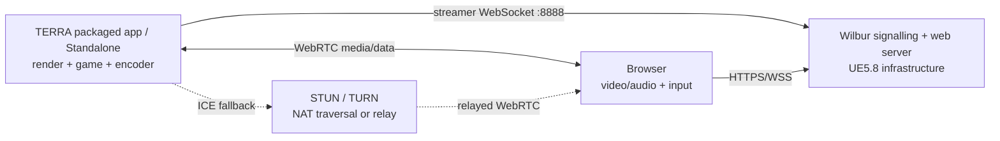
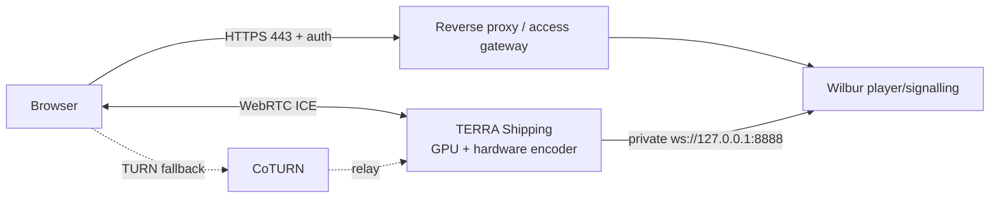

# TERRA — Pixel Streaming 2: локальный браузер и публичный доступ

**Дата аудита:** 2026-08-02  
**Статус:** localhost signalling smoke пройден; Pixel Streaming 2 включён; browser media/input smoke ещё не выполнен  
**Контур:** один локальный player, `127.0.0.1:8080/8888`, без STUN/TURN/SFU и публичного доступа

## 1. Вывод

TERRA можно показывать и управлять ею из современного браузера через Pixel Streaming 2. Для локального proof-of-concept достаточно текущего M3 Max, Mac-сборки/Standalone Game, signalling/frontend из ветки `UE5.8` и браузера на `localhost`. Для открытого Интернета Mac лучше не превращать в публичный production-сервер: минимальный надёжный путь — отдельная Windows/Linux GPU VM, HTTPS/auth, TURN и одна игровая сессия на одного пользователя либо явно общий сеанс.

Pixel Streaming не переносит симуляцию в JavaScript. Unreal продолжает считать игру и рендерить каждый кадр на host GPU, кодирует видео и принимает input из браузера.

## 2. Что найдено локально

| Проверка | Результат | Следствие |
|---|---|---|
| Unreal Engine | `/Users/Shared/Epic Games/UE_5.8` | Нужная версия установлена |
| Pixel Streaming 2 plugin | `Engine/Plugins/Media/PixelStreaming2` | Код plugin присутствует |
| Mac support | `PlatformAllowList` содержит `Mac`; dependency `VTCodecs` включается для Mac/iOS | Apple VideoToolbox является предусмотренным encoder path |
| Старый Pixel Streaming plugin | Тоже установлен | Для нового проекта выбирать Pixel Streaming 2, не включать оба без причины |
| TERRA `.uproject` | `PixelStreaming2` включён; UnrealEditor target собран | Следующий gate — Standalone/streamer smoke-test |
| Web servers | Официальная UE5.8 infrastructure собрана в `Tools/PixelStreamingInfrastructure-UE5.8` | Локальный Wilbur/library и player frontend готовы |
| Bundled downloader | По умолчанию выбирает `UE5.7`; явной обработки `-v 5.8` в локальном скрипте нет | Нельзя запускать downloader без явной ветки `UE5.8` |
| Официальная infrastructure | Ветка `UE5.8` помечена Current; `RELEASE_VERSION=0.1.0` | Сервер/frontend должны быть закреплены на UE5.8 release/commit |
| Node version | UE5.8 infrastructure закрепляет `v22.14.0` | Использовать эту версию, а не случайный системный Node |
| System Node/npm | Не установлены; project-local Node `v22.14.0` установлен в `Tools/.runtime` | Системный runtime и `sudo` не нужны |
| Docker/Homebrew | Не установлены | Для локального теста они не обязательны |
| Mac helper compatibility | UE5.8 `common.sh` вызывает GNU-форму `hostname -I`, которой нет на текущем macOS | Local signalling без TURN нужно smoke-test; встроенный Mac TURN launch не считать готовым без исправления/проверки |
| Host | Apple M3 Max, 30 GPU cores, arm64, Metal 4 | Подходит по классу Apple VideoToolbox; нужен фактический encoder smoke-test |
| OS | macOS 26.5.2 | Не входит в опубликованный Pixel Streaming tested-list; проверка обязательна |
| Unreal tools | `UnrealEditor`, `UnrealEditor-Cmd`, `RunUAT.sh` присутствуют | Standalone/cook/package технически доступны |
| TERRA package | Cooked/packaged `.app` пока отсутствует | Первый тест можно делать Standalone Game, затем Mac Shipping package |

## 3. Компоненты



- Unreal и Pixel Streaming 2 plugin создают изображение, звук и input channel.
- Wilbur договаривается о соединении и раздаёт player web app.
- STUN помогает установить прямое соединение через NAT.
- TURN ретранслирует поток, когда direct WebRTC невозможен.
- Для одного независимого игрока нужен один авторитетный игровой сеанс. Несколько браузеров, подключённых к одному процессу, по умолчанию видят один мир и могут делить управление.

## 4. Минимальный локальный путь

Ниже зафиксированы уже выполненная localhost-сборка и оставшиеся live gates.

### 4.1. Gate до Pixel Streaming

Сначала должен пройти functional PIE-test обычной TERRA:

- `L_capital` запускается с `TerraGameModeBase`;
- first-person Character появляется над collision terrain;
- ходьба, камера, прыжок, sprint/crouch и `E` работают;
- focus trace и interaction RPC проверены;
- обычный Standalone Game не имеет fatal/error.

Streaming бессмысленно диагностировать одновременно с неисправным gameplay.

### 4.2. Pixel Streaming 2 — выполнено

`PixelStreaming2` включён в `Terra.uproject`, legacy `PixelStreaming` не
включён. UnrealEditor target после изменения успешно собран. Headless runtime
tests также проходят; PIE gameplay и encoder/WebRTC остаются live gates.

### 4.3. Совместимая infrastructure — выполнено

Engine installation не изменялась. Официальный dependency закреплён отдельно:

```bash
mkdir -p "/Users/bekzodik/Documents/Unreal Projects/Terra/Tools"
git clone --depth 1 --single-branch --branch UE5.8 \
  https://github.com/EpicGames/PixelStreamingInfrastructure.git \
  "/Users/bekzodik/Documents/Unreal Projects/Terra/Tools/PixelStreamingInfrastructure-UE5.8"
```

Используется commit `1d1e515e97c026d1f376f329d5f005f58eabb234`,
`RELEASE_VERSION=0.1.0`, `NODE_VERSION=v22.14.0`. Они и SHA-256 Node archive
записаны в `Scripts/PixelStreaming/dependency-lock.json`; runtime и checkout
игнорируются Git. `npm ci` и `npm run build:all:cjs` завершились успешно.

Альтернатива — локальный `get_ps_servers.sh -b UE5.8`, но он скачивает файлы внутрь Engine plugin directory и менее удобен для version control.

### 4.4. Безопасный localhost launcher — готов

Официальный reference launcher не используется: он не предоставляет CLI bind
address для обоих listener и его TURN helper зависит от отсутствующей на macOS
GNU-формы `hostname -I`. Вместо него небольшой launcher использует официальный
собранный signalling library, но явно привязывает HTTP/player и streamer к
`127.0.0.1`.

```bash
cd "/Users/bekzodik/Documents/Unreal Projects/Terra"
Scripts/PixelStreaming/bootstrap_local.sh
Scripts/PixelStreaming/check_local.sh --dependencies-only
Scripts/PixelStreaming/start_local.sh
Scripts/PixelStreaming/check_local.sh
Scripts/PixelStreaming/stop_local.sh
```

Ожидаемо:

- frontend: `http://127.0.0.1:8080/player.html`;
- streamer WebSocket: `127.0.0.1:8888`;
- `max_players=1`, empty `iceServers`, STUN/TURN/SFU/REST отключены;
- Host и browser WebSocket Origin ограничены локальным endpoint;
- launcher не содержит `sudo` и не открывает privileged/public ports;
- health-check дополнительно проверяет bind через `lsof` и отсутствие
  SFU/STUN/TURN listeners.

`bootstrap_local.sh` только воспроизводит npm build и не запускает сервис.
Полный `npm audit` показывает 5 замечаний в upstream dev tooling, но
`npm audit --omit=dev` для runtime dependencies — 0 vulnerabilities.

Loopback smoke подтвердил health JSON, выдачу `player.html`, оба listener
строго на `127.0.0.1`, отсутствие запрещённых listener и корректный stop.
В момент проверки signalling видел один streamer и 0 players. Это не заменяет
browser-проверку изображения, звука, input, codec и длительной стабильности.

### 4.5. Запустить TERRA streamer

Для первого теста — отдельный **Standalone/Game process**, не обычный PIE
viewport. Проверенный URL запускает audited ground-level reality slice, не
legacy `L_capital`:

```text
"/Engine/Maps/Entry?game=/Script/TerraRuntime.TerraRealitySliceGameMode" -game
-PixelStreamingConnectionURL=ws://127.0.0.1:8888 -RenderOffScreen -ForceRes
-ResX=1920 -ResY=1080
```

Затем запустить Standalone Game и открыть:

```text
http://127.0.0.1:8080/player.html
```

После Standalone proof-of-concept собрать Mac Development/Shipping `.app` и запускать его явно:

```bash
"/absolute/path/Terra.app/Contents/MacOS/Terra" \
  "/Engine/Maps/Entry?game=/Script/TerraRuntime.TerraRealitySliceGameMode" \
  -PixelStreamingConnectionURL=ws://127.0.0.1:8888 \
  -RenderOffScreen -ForceRes -ResX=1920 -ResY=1080
```

`-RenderOffScreen` предотвращает остановку кадра из-за минимизации окна. Разрешение 1080p — стартовый benchmark, не финальная гарантия.

### 4.6. Приёмка localhost

- браузер показывает именно `TerraRealitySliceGameMode`, ground-level HUD и
  маркировку `SPATIAL PROTOTYPE / BLOCKOUT`;
- видео, звук, мышь, WASD и `E` доходят до игры;
- fullscreen/pointer lock восстанавливаются после потери focus;
- H.264/VideoToolbox encoder и WebRTC stats не содержат ошибок;
- 15 минут без disconnect, memory growth и блокирующих hitch;
- сравнить native и streamed FPS/frame time;
- проверить Safari и Chrome на этом Mac;
- закрытие browser корректно освобождает peer/encoder resources.

Телефон/LAN не входит в текущий контур: сервер намеренно слушает только
loopback. Это отдельный сетевой и security milestone.

## 5. Удалённый приватный тест

Перед открытым Интернетом использовать закрытую LAN/VPN-модель:

1. TERRA и signalling остаются на M3 Max.
2. Доступ разрешён только одному доверенному устройству через VPN.
3. Player port не публикуется на домашнем роутере для всего Интернета.
4. При проблемах NAT добавляется собственный TURN с уникальными credentials.
5. Mac не спит, приложение запускается отдельным пользователем без доступа к секретам разработки.

Epic рекомендует начинать с LAN/VPN. Это позволяет измерить реальный upload/latency без преждевременной production-инфраструктуры.

## 6. Минимальный публичный путь

### 6.1. Рекомендуемая форма первого public demo

Одна защищённая GPU VM, один TERRA-процесс, один пользователь одновременно:



### 6.2. Последовательность

1. Создать Shipping package для OS cloud-host. Большинство доступных GPU VM — Windows/Linux; Mac package на них не запускается.
2. Для Windows package нужен Windows build node/toolchain; для Linux — отдельный проверенный Linux pipeline.
3. Выбрать VM с GPU и hardware H.264 encoder; A10/L4/Ada-class является разумной стартовой категорией, но SKU утверждается только после benchmark TERRA.
4. Разместить UE5.8 infrastructure, закреплённую на release/commit.
5. Запускать TERRA, Wilbur и CoTURN от непривилегированных service accounts.
6. Поставить TLS domain и authentication перед player page.
7. Оставить streamer port 8888 приватным; наружу открыть только HTTPS и минимальные TURN ports/range.
8. Запускать TERRA с `-RenderOffScreen`, фиксированным разрешением и Pixel Streaming URL на localhost/private network.
9. Ограничить один player, input ownership и idle timeout.
10. Добавить health check, crash restart, logs, GPU/WebRTC metrics, cost alert и автоматическое выключение idle VM.
11. Только после стабильного single-user demo проектировать очередь и независимые сеансы.

### 6.3. Почему не домашний Mac как production-host

- сон, обновление и локальная работа прерывают stream;
- домашний upload, NAT/CGNAT и динамический IP не гарантируют доступность;
- открытые TURN/WebRTC ports увеличивают площадь атаки домашней сети;
- нет process/tenant isolation для публичных пользователей;
- Mac package нельзя перенести на обычную Windows/Linux GPU VM;
- локальные исходники, UE Editor и секреты разработки не должны находиться рядом с публичным endpoint;
- масштабирование невозможно без выделения новых процессов/машин.

Mac остаётся хорошим development и LAN-demo host.

## 7. Ограничения macOS и GPU

- Pixel Streaming 2 plugin локально разрешает Mac и использует `VTCodecs`/VideoToolbox.
- Epic указывает Apple M-series как hardware H.264 encoding path; это делает M3 Max обоснованным кандидатом для localhost/LAN.
- Фактические codec, bitrate, encode latency и peer limits нужно снять через WebRTC/Pixel Streaming stats.
- Не предполагать AV1 encode на M3 Max: официальный reference связывает аппаратный AV1 streaming path с NVIDIA Ada-class; первый Mac target — H.264.
- VP8/VP9 используют CPU и масштабируются по peer, поэтому не являются первым выбором для тяжёлой TERRA.
- Рендер и encode делят thermal/power/memory budget. Ray tracing, Lumen, MetaHuman grooms и 4K могут ухудшить stream даже если native viewport выглядит приемлемо.
- Опубликованный tested-list Pixel Streaming не содержит текущую macOS 26.5.2. Наличие plugin и успешная компиляция не заменяют 15-минутный stream test.
- На production GPU VM приложение надо размещать географически близко к пользователю; расстояние напрямую добавляет input latency.

## 8. Сеть и порты

### Localhost (реализовано)

| Назначение | Порт плана | Exposure |
|---|---:|---|
| Browser/player HTTP | TCP 8080 | `127.0.0.1` only |
| UE streamer WebSocket | TCP 8888 | localhost only |
| STUN | внешний/настроенный | только при необходимости |
| TURN | не нужен | выключен |

### Public

| Назначение | Рекомендация |
|---|---|
| Player/signalling | HTTPS/WSS 443 через gateway/reverse proxy |
| Streamer 8888 | private loopback/VPC, не public |
| STUN | доверенный внешний или собственный |
| TURN control | обычно 3478/5349 по выбранной TLS/UDP схеме |
| TURN relay | узкий явно настроенный UDP range, отражённый в firewall |

Не открывать на домашнем роутере огромный relay range «на всякий случай». Точный CoTURN range задаётся конфигурацией и security group. Мобильные и корпоративные сети часто требуют TURN; STUN alone не гарантирует соединение.

## 9. Сеансы и масштабирование

### Один общий сеанс

- один UE process;
- несколько viewers видят одну камеру/мир;
- по умолчанию input может приходить от нескольких browser peers;
- подходит для controlled presentation, если только один пользователь получает input ownership.

### Независимые игроки

- каждому нужен отдельный авторитетный UE session/process либо полноценная multiplayer-архитектура;
- процесс потребляет GPU/CPU/RAM и encoder capacity;
- требуется очередь, provisioner, session routing, health/idle lifecycle;
- старый reference Matchmaker deprecated начиная с UE 5.5 и не является production scaler;
- Epic прямо описывает reference servers как основу, которую нужно дополнять production-логикой;
- SFU остаётся experimental и нужен для one-to-many, а не для первого independent-player demo.

Поэтому milestone №1 — `max_players=1`, а не «публичная MMO через браузер».

## 10. Стоимость

### 10.1. Что почти бесплатно

- localhost/LAN: нет cloud compute и egress bill;
- UE Pixel Streaming infrastructure распространяется как reference implementation;
- TLS-сертификат может быть бесплатным;
- остаются электричество, домашний Интернет, время сборки и storage.

### 10.2. Public GPU cost model

Точные цены нестабильны и зависят от provider, региона, OS, GPU и reserved/spot условий. До выбора провайдера использовать формулу:

```text
monthly_compute = GPU_instance_price_per_hour × running_hours × concurrent_instances
```

- 8 часов в день ≈ 240 instance-hours/месяц;
- 24/7 ≈ 720 instance-hours/месяц;
- независимый peak concurrency обычно требует сопоставимого числа UE sessions.

Traffic estimate:

```text
GB per stream-hour ≈ bitrate_Mbps × 0.45
```

| Средний bitrate | GB за stream-hour | GB за 100 user-hours |
|---:|---:|---:|
| 5 Mbps | 2,25 | 225 |
| 8 Mbps | 3,60 | 360 |
| 15 Mbps | 6,75 | 675 |
| 20 Mbps | 9,00 | 900 |

TURN переносит media через relay и может добавить оплачиваемый трафик и latency. Кроме GPU учитываются disk snapshot, logs/metrics, domain, reverse proxy/auth, TURN и egress.

Минимальные меры экономии:

- VM выключена вне demo window;
- idle timeout завершает UE process;
- один пользователь/instance до профилирования multi-process density;
- 1080p и контролируемый bitrate раньше 4K;
- budget alerts и hard quota;
- регион рядом с пользователем уменьшает latency, но его цену проверять отдельно.

Не выбирать managed service только по названию: например, текущая официальная документация Amazon GameLift Streams перечисляет Unreal Engine лишь до 5.6, поэтому совместимость TERRA/UE 5.8 должна быть подтверждена до любых затрат. Azure reference/Marketplace также требует отдельной проверки актуальной поддержки 5.8.

## 11. Security checklist

Public gate закрыт, пока не выполнено всё:

- Shipping build, не публичный Unreal Editor;
- HTTPS/WSS с действительным сертификатом;
- authentication/authorization перед player page;
- `max_players=1` для первого demo;
- явный input owner; viewers не получают управление;
- 8888 и admin endpoints не доступны из Интернета;
- REST API Wilbur выключен, если не нужен;
- уникальные TURN credentials; никаких sample/default passwords;
- firewall открывает только необходимые ports/range;
- rate limit, connection timeout, body/message limits;
- services работают без root/admin;
- UE process изолирован от исходников, Keychain, Atlas write credentials и GitHub tokens;
- AI/диалоговые ключи остаются в backend secret store и не уходят browser-клиенту;
- logs не содержат токены, полный пользовательский текст и персональные данные без необходимости;
- микрофон/камера требуют явного consent и HTTPS;
- crash restart имеет предел, чтобы не создать бесконечный bill loop;
- DDoS/abuse monitoring и немедленный kill switch;
- dependency/SBOM review для pinned infrastructure и npm lockfile;
- no public launch до penetration/basic abuse test.

## 12. Acceptance gates

### PS-LAN

- UE5.8/Pixel Streaming 2 + infrastructure UE5.8;
- 1080p H.264 VideoToolbox stream 15 минут;
- mouse/keyboard/touch input;
- audio;
- один peer;
- reconnect после browser refresh;
- measured latency/FPS/bitrate/packet loss;
- ноль fatal/error и secret leakage.

### PS-PRIVATE

- доверенный удалённый пользователь через VPN;
- TURN fallback проверен на отдельной сети;
- access revocation работает;
- Mac sleep/update/restart procedure документирована;
- session ends and resources free.

### PS-PUBLIC

- dedicated GPU host и Shipping package;
- HTTPS/auth/firewall/TURN/security checklist;
- cost cap и auto-shutdown;
- one-user isolation;
- 60-минутный soak с reconnect;
- mobile + desktop browser matrix;
- incident rollback/kill procedure.

## 13. Решения перед изменением проекта

1. Включать Pixel Streaming 2 сразу после обычного PIE gate или после R2 clean import?
2. Первый browser target: localhost, LAN или один удалённый tester?
3. Общий presentation stream или независимый session?
4. 1080p30 или 1080p60 как первый target?
5. Нужны ли microphone/touch на первом этапе?
6. Для public demo: Windows или Linux package и где находится build node?
7. Какой регион пользователей и максимальный месячный GPU/egress budget?
8. Кто владеет domain, TLS, auth и incident shutdown?

Рекомендация: `PIE gate → localhost 1080p30 H.264 → LAN phone → private VPN tester → dedicated public GPU VM`. Каждый переход проходит свой acceptance gate.

## 14. Официальные источники

- [Getting Started with Pixel Streaming — UE 5.8](https://dev.epicgames.com/documentation/en-us/unreal-engine/getting-started-with-pixel-streaming-in-unreal-engine)
- [Pixel Streaming 2 Overview — UE 5.8](https://dev.epicgames.com/documentation/unreal-engine/pixel-streaming-2-overview-in-unreal-engine?lang=en-US)
- [Pixel Streaming Reference — UE 5.8](https://dev.epicgames.com/documentation/unreal-engine/unreal-engine-pixel-streaming-reference?application_version=5.8)
- [Hosting and Networking Guide](https://dev.epicgames.com/documentation/en-us/unreal-engine/hosting-and-networking-guide-for-pixel-streaming-in-unreal-engine)
- [Stream Tuning Guide — UE 5.8](https://dev.epicgames.com/documentation/en-us/unreal-engine/stream-tuning-guide)
- [Official Pixel Streaming Infrastructure](https://github.com/EpicGames/PixelStreamingInfrastructure/tree/UE5.8)
- [UE5.8 pinned Node version](https://raw.githubusercontent.com/EpicGames/PixelStreamingInfrastructure/UE5.8/NODE_VERSION)
- [Wilbur Signalling/Web Server reference](https://github.com/EpicGames/PixelStreamingInfrastructure/blob/UE5.8/SignallingWebServer/README.md)
- [Azure Pixel Streaming reference architecture](https://learn.microsoft.com/en-us/gaming/azure/reference-architectures/unreal-pixel-streaming-at-scale)
- [Amazon GameLift Streams configuration support](https://docs.aws.amazon.com/gameliftstreams/latest/developerguide/choosing-configuration.html)
